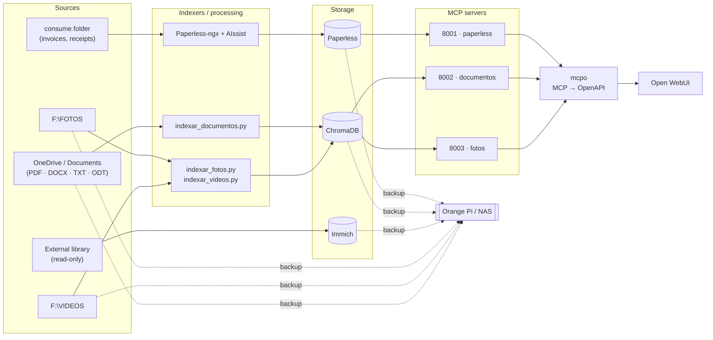
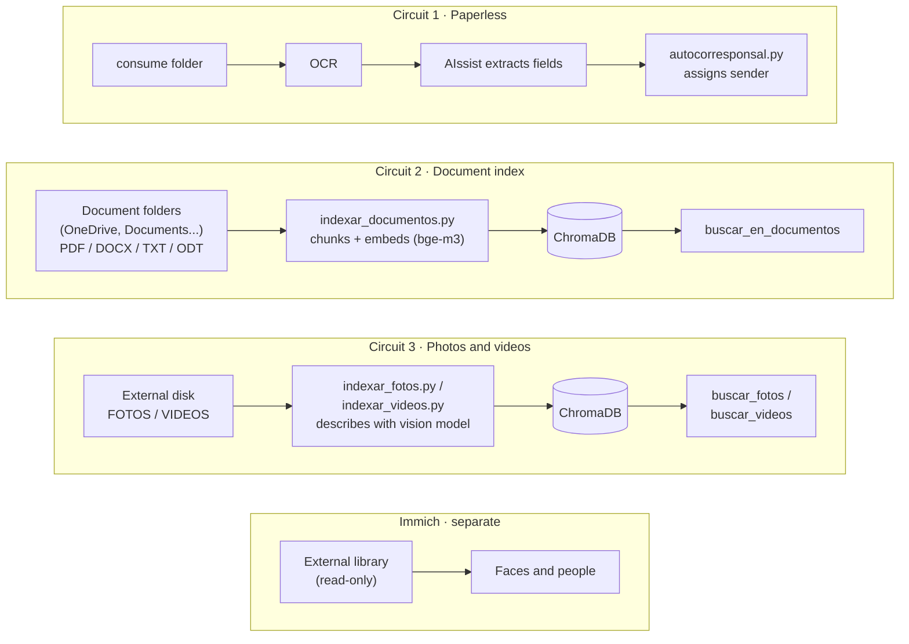

[Español](README.md) · [English](README.en.md)

# Local AI for document, photo and video management

> Self-hosted document and photo management with local AI: archive, index and search by content on your own PC, without sending your documents to the cloud.

[](LICENSE)
[](LICENSE-docs)
[](requirements.txt)
[](docker)


## The stack, at a glance



Immich is a separate circuit (faces and people, read-only external library) and isn't part of this simplified diagram — the full breakdown of the three circuits and why they're independent is in section 3.

## Screenshots

| | |
|---|---|
|  |  |
|  |  |

## Documentation

- [Backup restoration, verified procedure](docs/restauracion-backups.md) — the 6 backup blocks (ChromaDB, photos, videos, documents, Immich database, Open WebUI volume), with the real restoration procedure and the result of each test.

## 1. What it is and who it's for

A self-hosted, local-AI home setup for document and photo management: it automatically archives and classifies documents, lets you ask about the content of your PDFs, and find photos and videos by what appears in them — all running on your own PC, without sending your documents to the cloud.

### Is this for you?

I'm 64 and not a programmer. If I could set this up, you probably can too.

I'm not a programmer or a sysadmin. I can find my way around Windows, I follow
terminal instructions without fear, I read what a command returns and I ask when
I don't understand something. I don't know how to write these scripts from scratch and
I wouldn't have known how to diagnose half the failures on my own: I built this in
conversation with an AI, step by step, verifying each one.

If that's your level, this repo is for you: it's written so you can copy and paste, and
it explains the why behind each piece.

Two honest warnings. The first: it took me about **35 hours spread over 8 sessions
over the course of a week**, and you need patience for the dead ends. The second, more
important one: by the end you'll have a system more complex than you can keep in your
head. Document your setup as you go — in this repo you'll see the daily-use guide was
one of the last things written, and one of the most useful.

If you're technical, you'll find the explanations excessive; go straight to the scripts
and to the lessons-learned section.

## 2. Hardware and requirements

This setup has been tested on a Windows PC with an RTX 5080 GPU (16 GB VRAM), 32 GB of system RAM and Docker Desktop. That's the hardware every figure in this README is measured against; it hasn't been tested with less, so no unverified minimum is claimed here.

VRAM and RAM play different roles here and can't substitute for one another: GPU VRAM is what matters for Ollama's models (if a model doesn't fit in VRAM, it offloads to CPU and becomes unusable, as explained below); system RAM is what Docker Desktop and the rest of the stack's containers (Paperless-ngx, Immich, ChromaDB, LiteLLM...) use while running at the same time.

What's known for certain: VRAM is the real limit. `gpt-oss:20b` is the largest model that fits in 16 GB. `qwen3.6:35b` was tried, which needed about 23 GB, and since it didn't fit it offloaded to CPU — usable in theory, but too slow in practice. Before picking a model, check its VRAM size against your GPU's.

## 3. Architecture, with diagram

There are three independent circuits. It's worth explaining it this way from the start because it's what confuses people most at the beginning: there isn't a single "pipeline," there are three that don't depend on each other.



1. **Paperless** — whatever gets dropped in the `consume` folder is OCR'd, AIssist extracts the fields, and `autocorresponsal.py` assigns the sender.
2. **Document index** — `indexar_documentos.py` walks the configured folders, chunks the text, embeds it with `bge-m3` and stores it in ChromaDB. Supports PDF, DOCX, TXT and ODT.
3. **Photos and videos** — `indexar_fotos.py` / `indexar_videos.py` describe each file with the vision model and index it. Queried with `buscar_fotos` / `buscar_videos`.

Immich is separate: faces and people, over a read-only external library — it doesn't share data with the other three circuits.

### Stack pieces

| Piece | Where | What for |
|---|---|---|
| Paperless-ngx | Docker, port 8010 | Document archive |
| Paperless-AIssist | Docker, Paperless add-on | Extracts fields with LLM and vision |
| Ollama | Native on Windows, port 11434 | Serves the local models |
| Open WebUI | Docker | Chat interface |
| ChromaDB | Local file | Semantic search |
| Immich | Docker, port 2283 | Photos, faces, people |
| LiteLLM | Docker, port 4000 | Gateway to Google models |
| mcpo | Windows, ports 8001–8003 | Converts MCP to OpenAPI for Open WebUI |
| OpenWhispr | Windows | Voice dictation (Parakeet TDT 0.6B) |

**mcpo ports:** 8001 Paperless · 8002 Documents · 8003 Photos/Videos.

**Access from the network:** mcpo (8001-8003) and LiteLLM (4000) only listen on `127.0.0.1` — unreachable from other devices. Paperless (8010) and Immich (2283) are reachable on your local network (details in section 9).

**Ollama models in use:** `gptoss-paperless` (gpt-oss:20b, `num_ctx` 16384, temp 0.1), `vl3-paperless` (qwen3-vl:8b, vision), `bge-m3` (document embeddings), `nomic-embed-text` (photo and video embeddings, legacy).

## 4. Step-by-step installation, by block

### 4.0 Folder structure

Before touching anything: pick a root folder for your install (in this README we call it `<TU_RAIZ>`; the author uses `D:\paperless` for everything Paperless-related). Inside `<TU_RAIZ>`, these need to live side by side, at the same level:

```
<TU_RAIZ>\
  docker-compose.yml      ← copy of docker/paperless/docker-compose.yml
  .env                    ← copy of docker/paperless/.env.example, filled in
  scripts\                ← the entire contents of this repo's scripts/
  chroma\                 ← ChromaDB creates this itself the first time you index
  data\ media\ export\ consume\   ← Paperless creates these itself on startup
```

This matters because `docker-compose.yml` mounts `./export` (relative to its own folder) and the Python scripts compute their base folder as "the folder that contains `scripts\`" (`Path(__file__).resolve().parent.parent`, see [scripts/config_rutas.py](scripts/config_rutas.py), imported from there by `indexar_documentos.py`, `mcp_documentos.py`, `buscar.py`, `salud.py`, `indexar_fotos.py`, `indexar_videos.py`, `mcp_fotos.py` and `limpiar.py`). If `docker-compose.yml` and `scripts\` aren't at the same level, the two paths stop matching. Immich and LiteLLM are independent: each can live in its own folder (`docker/immich/`, `docker/litellm/` in this repo), unrelated to `<TU_RAIZ>`.

### 4.1 Docker Desktop

Install it and leave it running (with WSL2 integration if you're going to use the GPU for Immich).

### 4.2 Paperless-ngx + AIssist

1. Copy `docker/paperless/docker-compose.yml` and `docker/paperless/.env.example` to `<TU_RAIZ>`.
2. Rename the `.env.example` copy to `.env` and fill in `POSTGRES_PASSWORD` and `PAPERLESS_SECRET_KEY` with your own values (never reuse an example from a README).
3. From `<TU_RAIZ>`: `docker compose up -d`.

**⚠️ Note on the Docker volume:** `indexar_documentos.py` applies OCR by copying the PDF to `<TU_RAIZ>\export\ocr_auto` and then running `ocrmypdf` **inside** the `paperless-webserver-1` container, on the fixed path `/usr/src/paperless/export/ocr_auto/` (see [scripts/indexar_documentos.py:102-117](scripts/indexar_documentos.py:102)). That internal path is defined by the `./export:/usr/src/paperless/export` bind mount in `docker-compose.yml`. If you follow the folder structure in 4.0, it lines up on its own; if you rename the container or change the volume mapping, you also need to update that path inside the script.

### 4.3 Immich

1. Copy `docker/immich/docker-compose.yml` and `.env.example` to their own folder (e.g. `<TU_RAIZ_IMMICH>`).
2. Fill in the `.env`: upload folder, your read-only external library drive, and its database credentials.
3. `docker compose up -d`.

### 4.4 LiteLLM (gateway to Gemini)

1. Copy `docker/litellm/docker-compose.yml`, `config.yaml` and `.env.example` to their own folder.
2. Fill in `GEMINI_API_KEY` with your Google AI Studio key.
3. `docker compose up -d`.

### 4.5 Ollama and the local models

Install Ollama (native on Windows, not Docker) and pull these four base models:

```
ollama pull gpt-oss:20b
ollama pull qwen3-vl:8b
ollama pull bge-m3
ollama pull nomic-embed-text
```

`bge-m3` and `nomic-embed-text` are used as-is, with no parameters of their own. The other two need a `Modelfile` to fix the context at 16384 (Ollama leaves it at 4096 by default — see section 8) and other generation parameters. They're in `ollama/`:

**`ollama/gptoss-paperless.Modelfile`**
```
FROM gpt-oss:20b
PARAMETER num_ctx 16384
PARAMETER temperature 0.1
```

**`ollama/vl3-paperless.Modelfile`**
```
FROM qwen3-vl:8b
PARAMETER num_ctx 16384
PARAMETER temperature 0.1
PARAMETER top_k 20
PARAMETER top_p 0.95
```

Create the custom models from those files:

```
ollama create gptoss-paperless -f ollama/gptoss-paperless.Modelfile
ollama create vl3-paperless -f ollama/vl3-paperless.Modelfile
```

From here on, Open WebUI and the scripts can use `gptoss-paperless` and `vl3-paperless` by name.

**Before deleting models to free up space**, these must never be touched, because they're the base of a custom model or the indexers use them directly:

- `gpt-oss:20b` — base of `gptoss-paperless`.
- `qwen3-vl:8b` — base of `vl3-paperless`.
- `qwen2.5-coder:14b` — base of `qwen2.5-coder:14b-32k`.
- `bge-m3` — embeddings for `indexar_documentos.py`/`mcp_documentos.py`.
- `nomic-embed-text` — embeddings for `indexar_fotos.py`/`indexar_videos.py`/`mcp_fotos.py`.

**`ollama list` can give misleading sizes.** Two different names can share the exact same blob on disk if they're the same unmodified model — the ID gives it away, not the name. For example, in a real install `gptoss-paperless` and an unrelated model (`web-search`) shared an ID (`1efcb56daf08`, 13 GB): they're the same file on disk under two names, and deleting one with `ollama rm` doesn't free those 13 GB if the other name still references it. Before deleting something to free space, check with `ollama list` whether its ID repeats under another name you want to keep.

### 4.6 ChromaDB

Doesn't need installing or its own container: it's Python's `chromadb` library, which each script opens directly on the `chroma\` folder (see 4.0). It's created automatically the first time you run an indexing script.

### 4.7 Python dependencies

All the scripts in `scripts\` and `mcpo` run on the same Python the `.bat` files use: **Python 3.14**, installed at `%USERPROFILE%\AppData\Local\Python\pythoncore-3.14-64` (the launchers invoke `...\bin\python.exe`).

Install everything at once, with the exact versions running today on the real install — checked against `pip freeze`, same principle as the Docker digests: freeze what works, don't open up ranges:

```bash
%USERPROFILE%\AppData\Local\Python\bin\python.exe -m pip install -r requirements.txt
```

See [`requirements.txt`](requirements.txt) for the detail of what each script uses.

### 4.8 mcpo

Installed along with everything else in `requirements.txt` (previous section). Version used: `0.0.20`.

Once installed, each `start-mcp-*.bat` in `scripts\` starts its own server (ports documented in section 3).

### 4.9 Script secrets

Copy `scripts/secrets.local.bat.example` to `scripts/secrets.local.bat` and fill in your real Paperless token (Settings → API Tokens in the Paperless-ngx interface) and your Immich key (Settings → API Keys) — the latter is used by `mcp_fotos.py`'s Immich tools (`listar_personas`, `listar_personas_sin_nombre`, `fotos_por_lugar`, `fotos_por_fecha`), read-only permissions are enough (`person.read`, `asset.read`, `face.read`).

### 4.10 Scheduled tasks

See section 7 for how to hook these into Windows Task Scheduler.

### 4.11 Aider with local fallback (optional)

This isn't part of the day-to-day setup: it's the tool the author uses to edit this repo's own code from WSL. Documented in case it's useful for your case — it isn't needed for the rest of the stack to work.

**When to use it:** when Claude's tokens run out mid-session and you need to keep editing code without waiting. Not a regular substitute: it's just a stopgap.

**How to set it up:**
1. Copy [aider/.aider.conf.yml.example](aider/.aider.conf.yml.example) to your project (or your `$HOME`), rename it (e.g. `.aider.conf.yml.local`) and fill in your WSL IP following the instructions inside the file itself.
2. Make sure you have the model pulled: `ollama pull qwen2.5-coder:14b-32k`.
3. Launch it explicitly with `aider -c .aider.conf.yml.local` — Aider doesn't switch models on its own, the choice is always manual.

**Limitations, seriously:** `qwen2.5-coder:14b` is far weaker than Claude for tasks that touch several files or need a broad understanding of the project's context. Use it only for narrow changes and simple prompts, and always review the code it generates before accepting it — more so than with Claude, given a model this size.

## 5. The scripts

They all live in `scripts\`. The launchers (`run-*.bat`, `run-*.vbs`, `start-mcp-*.bat`) are explained in section 7; here are just the scripts that do the actual work.

| Script | What it does |
|---|---|
| `autocorresponsal.py` | Reads the Vendor/sender field of every document with no correspondent assigned and creates/assigns the matching one in Paperless. Normalizes Unicode to avoid duplicates from accents. |
| `buscar.py` | Terminal semantic search over the indexed PDFs, to test queries without going through Open WebUI. |
| `config_rutas.py` | No executable of its own: path and configuration constants shared by eight scripts — documents (`indexar_documentos.py`, `mcp_documentos.py`, `buscar.py`, `salud.py`: `CARPETAS_PDFS`, `CARPETA_DB`, `MODELO`, `EXTENSIONES`...) and photos/videos (`indexar_fotos.py`, `indexar_videos.py`, `mcp_fotos.py`, `limpiar.py`: `OLLAMA_BASE`, `MODELO_VISION`, `MODELO_EMBED_FOTOS`) — so there's no need to keep loose copies of each. |
| `indexar_documentos.py` | Indexes PDF, DOCX, TXT and ODT from the configured folders. If a PDF has no text, it applies automatic OCR (with a backup copy to `backup_pdfs` first) and retries — DOCX/TXT/ODT never need OCR, they always carry native text. |
| `mcp_documentos.py` | MCP server: exposes `buscar_en_documentos`, `listar_documentos_indexados`, `abrir_documento` (restricted to the indexed folders: rejects, with a clear message, any path outside them) and `contar_documentos`. |
| `indexar_fotos.py` / `indexar_videos.py` | Index the external disk. Videos, with 3 frames extracted via ffmpeg. Incremental: only processes what's new. |
| `mcp_fotos.py` | MCP server: exposes `buscar_fotos`, `buscar_videos`, `estadisticas_fotos`, `listar_personas`, `listar_personas_sin_nombre`, `fotos_por_lugar` and `fotos_por_fecha` (the last four filter and count in code instead of sending the model Immich's raw JSON, same reason as `contar_documentos` — parameters and details for each, right below); generates an HTML gallery with the search results. |
| `duplicados.py` | Detects duplicate photos (SHA-256 + pHash) and videos (SHA-256) on the external disk. Generates a `.txt` report and a `.json` plan. Deletes nothing. |
| `revisar.py` | Generates an interactive HTML page to eyeball the duplicates and download the list of what's confirmed for deletion. |
| `limpiar.py` | Moves confirmed duplicates from `revision.html` to quarantine. Never deletes directly; requires typing "SI" to continue. |
| `vigilante.py` | Watches whether the external disk is connected and whether there are new duplicates; only opens `revision.html` when something has changed since last time. |
| `organizar_fotos.py` | Reorders photos on the external disk into `AAAA\MM-Mes` folders based on EXIF date (or the filename as a fallback). Simulates only by default; needs `--aplicar`. |
| `organizador.py` | Organizes the Downloads folder by file type (Images, PDFs, Documents, Installers...). |
| `oculto.vbs` | Launches whichever `.bat` is passed as an argument without showing a window. |
| `backup-orangepi.bat` | Copies Paperless, ChromaDB, photos, videos, the two document folders to index (`Documents` and OneDrive), the Immich database and the Open WebUI volume to a NAS/Orange Pi over the network (`scp`/`rsync`/`pg_dump`/`docker run` via WSL). Has no scheduled task of its own; see "What this setup doesn't solve" in section 9 for details and limitations. |
| `salud.py` | Checks the state of the whole stack (mcpo ports, Docker containers, Ollama, LiteLLM, scheduled tasks, ChromaDB, the `consume` folder, external disk, duplicate quarantine...) and generates `salud.html` with the result. Run by hand with `salud.bat`, has no scheduled task. |

`salud.html`, the report it generates, is regenerated on every run inside `scripts\` and isn't version-controlled (it's in `.gitignore`). **It's sensitive**: it lists scheduled tasks, Docker containers, model versions, free disk space and the state of the `consume` folder — a fairly complete inventory of your install. Don't share it or upload it anywhere.

### `mcp_fotos.py` tools (port 8003)

The last three (`listar_personas_sin_nombre`, `fotos_por_lugar`, `fotos_por_fecha`) query the Immich API directly — no LLM or ChromaDB involved — and never return paths, file names or thumbnails, only numbers and IDs.

| Tool | Parameters | What it returns | When to use it |
|---|---|---|---|
| `buscar_fotos` | `consulta: str`, `maximo: int = 12` | Opens an HTML gallery with the photos closest to the query (thumbnail, path, distance). | Searching for photos by what's in them (people, places, objects, scenes). |
| `buscar_videos` | `consulta: str`, `maximo: int = 12` | Same as `buscar_fotos`, but for videos. | Searching for videos by content. |
| `estadisticas_fotos` | none | Total indexed and breakdown by folder and by year, for photos and videos. | "How many photos/videos do I have indexed, and from which years." |
| `listar_personas` | none | Name and photo count for each person **with a name** in Immich. No IDs, thumbnails or paths. | "What people do I have tagged" / "how many photos are there of X". |
| `listar_personas_sin_nombre` | `min_fotos: int = 20` | ID and photo count for each **unnamed** face in Immich, most photos first. | Deciding which unidentified faces are worth naming or merging first (see "Merging duplicate people" in section 9). |
| `fotos_por_lugar` | `lugar: str`, `anio: int \| None = None` | Total photo count for that place (`city`/`country` from EXIF via Immich), broken down by year or, if `anio` is given, by month. | "How many photos do I have from Madrid" / "how many from Paris in 2023". |
| `fotos_por_fecha` | `desde: str`, `hasta: str` (`YYYY-MM-DD`) | Photo count in the range, broken down by month. | "How many photos do I have between March and July 2022". |

## 6. The prompts

The two full prompts are in [`prompts/factura-aissist.md`](prompts/factura-aissist.md) and [`prompts/openwebui-gptoss.md`](prompts/openwebui-gptoss.md). The address, invoice number and CIF examples they contained were replaced with made-up ones; the rest is the real text used in production.

### `factura-aissist.md`

The prompt **Paperless-AIssist** uses to read every new document and fill in its custom fields (amount, VAT, vendor, date, whether it's paid...) without manual intervention. Those fields are what `autocorresponsal.py` (Vendor field) and Paperless's tools in Open WebUI (Total amount field) consume afterward.

### `openwebui-gptoss.md`

The `gptoss-paperless` model's *system prompt* in Open WebUI. Its job is to stop the local model from answering "I don't have access to that" when it does have tools to find out, and to keep it from confusing the four distinct sources of information it can run into: Paperless (`tool_*`), loose OneDrive documents (`buscar_en_documentos`), the local photo/video index by content (`buscar_fotos`/`buscar_videos`), and Immich's data on people, place and date (`listar_personas`, `listar_personas_sin_nombre`, `fotos_por_lugar`, `fotos_por_fecha`) — the last four from the same MCP server (`mcp_fotos.py`, port 8003).

### Lessons behind these rules

- **Amounts as a string with an `EUR` prefix** (`"EUR32.16"`, never `32,16 €` or a JSON number) — so the same format works unambiguously in two places: as the uniform text Paperless stores in the custom field, and as a value Open WebUI's tools parse literally to add up (step 5 of the system prompt: *"Its value has the form 'EUR1129.00'"*). A JSON number would have clashed with the Spanish decimal comma; a string with the `€` symbol would have been harder to parse consistently across OCR, AIssist and the tools.
- **The "Paid" boolean requires explicit `false`, never `null`** — leaving it `null` leaves the document in an ambiguous state ("no data" instead of "not paid"), which breaks any later binary filter or query. Forcing `false` as the default value turns the field into a question that always has an answer.
- **110-character limit on "Work performed"** — the prompt enforces that cap because it's what works in practice; it's not verified exactly where the limit comes from (this doesn't claim it's Paperless's database limit or any other specific origin). Without that cap, AIssist tends to generate long descriptions that fail to save or get truncated mid-word.
- **Chaining two tool calls instead of stopping at the first** — `gpt-oss:20b` tends to settle for the first result (the correspondent list from `tool_list_correspondents_post`) and answer with that, without taking the necessary second step (`tool_list_documents_post` with that id) to reach the amounts. The prompt has to say it explicitly ("Never stop after step 1") because, left to its own judgment, the model stops too early. It's the flip side of a lesson already noted in section 8: enabling more than one tool per chat tends to make the model call the wrong one — here the problem isn't picking wrong, it's not chaining when it needs to.

## 7. Automation with scheduled tasks

### Why `oculto.vbs`

Windows Task Scheduler, when running a `.bat` directly, briefly shows a black console window. `oculto.vbs` avoids that: it's a generic, single-purpose launcher —

```vbs
Set s = CreateObject("WScript.Shell")
s.Run """" & WScript.Arguments(0) & """", 0, False
```

— that takes the path of a `.bat` as an argument and runs it with a hidden window (the `0`) without waiting for it to finish (the `False`). It's used as the scheduled task's action instead of pointing straight at the `.bat`.

### How each launcher chains

- **`run-autocorresponsal.vbs`** — doesn't use `oculto.vbs`, it has its own hidden launcher built in; it simply runs `run-autocorresponsal.bat` with no window. That `.bat` loads `secrets.local.bat` and runs `autocorresponsal.py`.
- **`run-vigilante.vbs`** — runs three scripts in a chain, with one important difference in the third:
  1. `vigilante.py`, **waiting** for it to finish (checks whether there are new duplicates on the external disk and opens `revision.html` only if there are).
  2. `indexar_fotos.py`, also **waiting**.
  3. `indexar_videos.py`, **not waiting** — it's launched in the background and the scheduled task is marked complete even if video indexing is still running.
- **`run-indexar.bat`**, **`run-organizador.bat`** — each calls its corresponding Python script; launched via `oculto.vbs` to avoid showing a console.
- **`start-mcp-fotos.bat`**, **`start-mcp-documentos.bat`**, **`start-mcpo.bat`** — start each `mcpo` server (they keep running, they're not tasks that finish); also launched via `oculto.vbs`.
- **`run-duplicados.bat`** — has no scheduled task of its own. It's a manual launcher to force a duplicate review outside the automatic `vigilante-duplicados` cycle (which already does its own check by calling `revisar.py` directly from `vigilante.py`).
- **`salud.bat`** — also has no scheduled task. It's meant to be run by hand when you want a stack diagnosis; that's why, unlike the other `.bat` files, it ends with `pause` (so you can read the result in the console) and doesn't go through `oculto.vbs`.

### The actual scheduled tasks

Created with `schtasks` from PowerShell as Administrator:

| Task | Action | Trigger |
|---|---|---|
| `autocorresponsal` | `run-autocorresponsal.vbs` | Repeats every 15 minutes |
| `vigilante-duplicados` | `run-vigilante.vbs` | Repeats every 15 minutes |
| `indexar-documentos` | `oculto.vbs` + `run-indexar.bat` | At logon |
| `organizador-descargas` | `oculto.vbs` + `run-organizador.bat` | At logon |
| `mcpo-paperless` | `oculto.vbs` + `start-mcpo.bat` | At logon |
| `mcp-documentos` | `oculto.vbs` + `start-mcp-documentos.bat` | At logon |
| `mcp-fotos` | `oculto.vbs` + `start-mcp-fotos.bat` | At logon |

Created with `schtasks ... /ru <usuario> /rl limited /f` — they run as the given user, with normal privileges, and `/f` overwrites without asking if the task already existed (handy for re-running the same creation command without it failing on a duplicate).

**Don't use `/rl highest`.** The 8 tasks were originally created that way, without needing it — none of them require elevated privileges to read/move files or call local APIs, and running with more privilege than necessary widens the blast radius if something is compromised. They were corrected to `Limited` without recreating them from scratch:

```powershell
$principal = New-ScheduledTaskPrincipal -UserId <usuario> -LogonType Interactive -RunLevel Limited
Set-ScheduledTask -TaskName <tarea> -Principal $principal
```

All 8 verified working the same way under `Limited`.

## 8. Lessons learned the hard way

- **VRAM**: `gpt-oss:20b` is the largest model that fits in 16 GB. `qwen3.6:35b` needed
  ~23 GB and offloaded to CPU. Check the fit before committing to a model.
- **Ollama caps context at 4096 by default.** You need to create a Modelfile with
  `num_ctx 16384` or long prompts fail without saying why.
- **Tesseract can't read low-contrast color tables.** No OCR setting fixes it.
  That needs a vision model (`vl3-paperless`).
- **But vision isn't the default answer**: it's slow and can make things up. Tesseract
  for everything, vision only for what fails.
- **AIssist**: the Process Tag and Processed Tag must be different (`ai-process` /
  `ai-processed`) or you get stuck in an infinite loop.
- **Embeddings**: `nomic-embed-text` is optimized for English and performed poorly in
  Spanish. `bge-m3` (1024 dim, cosine) fixed it.
- **Open WebUI**: the browser is what connects the tools, so the URL has to be
  `localhost`. The container is what makes the model connections, and that's where
  `host.docker.internal` goes. This inversion cost an entire evening.
- **Only one tool enabled per chat**: with several, the local model calls the wrong
  one.
- **mcpo is left with a hung session if you restart the service it points to.** When
  a container behind an `mcpo` bridge was recreated (it happened to a third-party MCP
  server that used `streamablehttp`, now retired) to change its binding to
  `127.0.0.1`, the corresponding `mcpo` stayed alive but started returning "Session
  terminated" — it was stuck with the previous, now-invalid MCP session. That `mcpo`
  had to be restarted too. Rule: when touching any service behind an `mcpo` bridge,
  restart the bridge too, not just the service.
- **`Get-Process node | Stop-Process` kills all three `mcpo` at once, not just the
  one you're after** — all three run as `node`/`python` processes indistinguishable
  by name. To restart just one: find its exact PID with
  `Get-NetTCPConnection -LocalPort <puerto> -State Listen` and kill only that one with
  `taskkill /F /PID <pid>`.
- **Open WebUI's tool selector shows the name the MCP server itself declares**
  (`FastMCP("...")` in Python, or the OpenAPI spec's title), not the name you give
  the connection in Open WebUI's Settings. It has caused confusion before — with
  `mcp_documentos.py` (`"pdfs-onedrive"` before, `"Documentos"` now).
- **`gpt-oss:20b` dumps the raw JSON instead of summarizing when a tool returns a
  large array.** With ~26 full documents (metadata, custom fields, versions...),
  instead of answering, the model starts reformatting the data into its own schema
  and never finishes replying. Ruled out one by one: chat thread, Open WebUI memory,
  the model's system prompt, and the Modelfile's `SYSTEM` — it's not a configuration
  problem, it's the model at `temperature 0.1` fitting the shape of the data into a
  pattern from its training. The fix isn't tweaking the prompt: it's providing
  deterministic tools that return already-computed values instead of lists the
  model has to process (`contar_documentos` in `mcp_documentos.py` is the first
  example).
- **ImmichMCP, retired entirely.** It returned Immich's raw, unfiltered API JSON
  (people listings, search results...): responses of up to ~56 s, and `gemini-flash`
  would sometimes pick it over the **fotos** tool even when the question was about
  content, not people. It also paginated badly — the same kind of bug `listar_personas`
  had until it was fixed (section 5). Replaced by the deterministic tools in
  `mcp_fotos.py` (`listar_personas`, `listar_personas_sin_nombre`, `fotos_por_lugar`,
  `fotos_por_fecha`), which query the Immich API directly and return only
  already-computed numbers — same principle as `contar_documentos`.
- **Local models and the outside world**: `gpt-oss:20b` makes things up and defends
  what it made up. No anchoring prompt fixes it. Local for your own documents, cloud
  for everything else.
- **Gemini used directly in Open WebUI** doesn't render the text properly (Google
  adds non-standard fields). Going through LiteLLM as a middleman fixes it.
- **Google's free tier quotas**: the newer models give 20 requests/day; the
  `-lite` ones are much more generous.
- **Always verify amounts and dates** by opening the document. That's why
  `abrir_documento` exists.

## 9. Limitations and what not to do

### What this setup doesn't solve

- **It doesn't recognize people in photos or videos.** The description prompts (`indexar_fotos.py`, `indexar_videos.py`) explicitly instruct the vision model: *"don't make up names of people or places"*. It will never tell you who's in a photo. Face and people recognition itself is Immich's job (a separate library); accessible from Open WebUI through `mcp_fotos.py`'s tools that query its API directly (`listar_personas`, `listar_personas_sin_nombre`), not through this content-based photo index.
- **The local model can make things up.** `gpt-oss:20b` invents things when you ask about something that isn't in your documents, and defends what it invented if you push back (section 8). Don't use it as a source of truth outside your own files.
- **No automatically extracted amount or date should be trusted without opening the document** — that's why the `abrir_documento` tool exists.
- **Duplicate detection never deletes anything on its own.** `duplicados.py`/`revisar.py` generate a report; `limpiar.py` only moves things to quarantine, and only after you type "SI" explicitly. Actually deleting is a manual step of your own, separate.
- **There's a backup script; the restores are tested, but not automated.** [`scripts/backup-orangepi.bat`](scripts/backup-orangepi.bat) copies Paperless's export, ChromaDB, photos, videos, the two document folders to index (`Documents` and OneDrive, in separate subfolders on the destination), the Immich database, and the Open WebUI Docker volume (chats, saved prompts, configuration) to a Raspberry/Orange Pi over the network (`scp`/`rsync`/`pg_dump`/`docker run` via WSL). ChromaDB is synced as an exact mirror (`--delete`, it's a rebuildable index); photos, videos and the two document folders accumulate without `--delete` on purpose, so as not to risk deleting the good copy if the external disk fails or unmounts badly, or if the source fails in any other way. The Open WebUI volume excludes `./cache` on purpose: those are regenerable embedding models, ~1 GB — without excluding them the dump weighs over 1 GB instead of 21 MB. Paperless restoration was tested successfully against an isolated container (procedure and result further below, "Tested restore: Paperless"); ChromaDB, photos, videos, the two document folders, the Immich database and the Open WebUI volume are now all tested too (see "Tested restore: Paperless" below and `docs/restauracion-backups.md`). If you don't adapt and schedule this script (or your own), there is no automatic backup of anything.
- **The two document folders are backed up separately, on purpose.** `indexar_documentos.py` reads from two places (section 9, "Rules that have already cost me time"): `OneDrive\Documentos\Documentos para indexar` and `Documents\Documentos para indexar`. At first the Orange Pi backup only copied the second — it was assumed the OneDrive one didn't need it, since OneDrive already syncs it to Microsoft's cloud on its own. That coverage isn't equivalent to a backup of your own (an accidental deletion replicates to the cloud just the same), so now both are backed up, each in its own destination subfolder (`documentos/` and `documentos-onedrive/`) instead of mixing them: since both `rsync` runs go without `--delete`, sharing a destination folder would make it impossible to tell, when restoring, which file came from which source.
- **OCR overwrites the original PDF in its real location** (`indexar_documentos.py`, the `ocr_en_sitio` function), not just the backup copy. If that folder is synced with OneDrive — like the two indexed by default —, the change triggers a re-upload to the cloud and a new entry in its version history. There's no way to avoid this without no longer touching the original.
- **The pre-OCR backup is named by source path, not just by file name** (`backup_pdfs/nombre_HASH.pdf`) — so two PDFs with the same name in different folders (e.g. `factura.pdf` in OneDrive and in Documents) don't overwrite each other's backup copy.
- **The whole stack assumes Spanish**: Paperless's OCR is fixed to `spa`, and the prompts are written in Spanish. Using it in another language means touching configuration and prompts.
- **It's a single PC, with no redundancy.** If it's off, there's no indexing, no Paperless, no tools in Open WebUI.

### Security model

A one-page summary, deduced from the real code, not from memory:

**What listens on `127.0.0.1` (only the PC itself, no other device on the network can reach it):**
- The three `mcpo`: 8001 (Paperless), 8002 (Documentos OneDrive), 8003 (Fotos disco externo).
- LiteLLM: 4000.

**What's exposed to the LAN, and why:**
- Paperless (8010) and Immich (2283). Deliberate: it's the only way to use them from a phone without setting up a VPN. They carry no authentication beyond each app's own. **Don't expose them to the internet** without adding your own authentication layer or VPN, and keep in mind that any other device on your Wi-Fi (a guest, a compromised IoT device) reaches them just like your phone does.

**Ollama (11434), scoped by firewall rather than open to the whole network:**
- It isn't bound to `127.0.0.1` because WSL needs to reach it (Aider uses it that way) and the phone talks to it directly from the Maid app (free, Android, talks straight to Ollama). Instead of leaving it open to the whole LAN, a Windows firewall rule ("Ollama 11434") restricts it to the WSL subnet (`172.19.240.0/20`) and to the phone's IP (example: `192.168.1.50` — substitute your real one). From Maid there are no MCP tools (documents, photos, Paperless): it's direct chat with the model, without the tools that work in Open WebUI.
- **Note 1:** the WSL subnet can change on a Windows restart. Check with `ip route | grep default` inside WSL and update the firewall rule if it has changed.
- **Note 2:** if the phone has an active VPN, the source IP changes and the rule blocks the connection — turn off the VPN to talk to Ollama, or add the IP your VPN assigns to the rule.

**Where the secrets live:**
- Tokens, API keys and passwords (Paperless token, Immich and Google keys, `PAPERLESS_SECRET_KEY`, Postgres password) live in `secrets.local.bat` and in the various `.env` files (one per Docker service: Paperless, LiteLLM). All of them are in `.gitignore` — never committed, **not even in a temporary commit you later delete**: git's history would keep them regardless. The repo's `.env.example`/`secrets.local.bat.example` files only carry placeholders — don't reuse those values or this README's, generate your own on every install.
- If a secret ever shows up in a chat, a screenshot, or a log you don't fully control, treat it as compromised and rotate it — even if it never actually got published. That's exactly what happened with `PAPERLESS_SECRET_KEY`, Immich's key and the Google AI Studio key while preparing this repo — all three were rotated for that reason, not because there was any sign of misuse.

### Tested restore: Paperless

A backup with no tested restore isn't a backup you can trust (section 9, "What this setup doesn't solve"). Here's what was tested, so it can be repeated:

1. **Bring the export from the Orange Pi**: `scp` (or `rsync`) the contents of `backup-nasa/paperless/` to an empty local folder, e.g. `<CARPETA_PRUEBA>\export`.
2. **Spin up an isolated Paperless**, without touching the real one: [`docker/paperless-restore-test/docker-compose.yml`](docker/paperless-restore-test/docker-compose.yml) — container and volume names with a `restore-` prefix, their own empty Postgres and Redis, port `8012` on `127.0.0.1` (neither `8010`, the real one, nor `8011`, already used by AIssist), the same digest-pinned images as the real Paperless. No AIssist, Tika or Gotenberg — not needed to import, only to process new documents. Copy that folder wherever you want to test, with the `export\` from step 1 inside it, and `docker compose up -d`.
3. **Import**: `docker exec restore-webserver document_importer /usr/src/paperless/export`.
4. **Verify** at `http://localhost:8012` that the documents arrive with correspondents, tags and custom fields intact — it's not enough for the container to just start.
5. **Clean up**: `docker compose down -v` in the test folder, so no leftover test containers or volumes are left behind.

**Real result of this test**: all 26 documents in the export arrived with correspondents, tags and custom fields intact.

**The other six backup blocks are also verified with a real restore**, tested on 2026-08-10: ChromaDB, photos, videos, the two document folders (`Documents` and OneDrive), the Immich database and the Open WebUI volume. Full procedure and results for each, in [`docs/restauracion-backups.md`](docs/restauracion-backups.md).

### Architecture audit

Besides the secrets review mentioned in Acknowledgments (Gemini, Kimi, Grok, Claude Code, `gitleaks`, TruffleHog), this repo went through a different audit: not looking for secrets in the code, but for attack paths in the architecture (a compromised Wi-Fi, a malicious document, a stolen API key, malware already running on Windows...). These points came out of that.

**Applied:**

- **Minimum privileges on scheduled tasks** — see section 7. The 8 tasks ran with `HighestAvailable` without needing it; corrected to `Limited` and verified working.
- **Pinned version of Paperless's MCP package** — `start-mcpo.bat` used `npx -y @baruchiro/paperless-mcp` with no version, downloading whatever was published on npm on every start. Pinned to `@2.0.1`.
- **`contar_documentos` as the first example of a deterministic tool** — see section 8. General principle: counting, summing, filtering and joining data is the code's job, not the model's; the LLM interprets the question and writes the answer, it doesn't do the arithmetic.
- **Validated paths in `limpiar.py`** — `duplicados_confirmados.json` can't make anything move outside the external disk's photo/video folders, even though the system itself generates it (see section 5).
- **AIssist (8011) restricted to `127.0.0.1`** — it was left published on the LAN without anyone having reviewed it.
- **Docker images pinned to a digest** instead of floating tags, across the whole stack: Paperless-ngx, Tika, Redis, Postgres, Gotenberg, AIssist, LiteLLM, Immich (server, machine-learning, its Postgres and its Redis/Valkey) no longer use `:latest`/`:release`/loose tags. Concrete reason, not just theoretical: LiteLLM had malicious versions published on PyPI in March 2026. No floating image is left in the repo.
- **Paperless restore tested** against an isolated container ([`docker/paperless-restore-test/`](docker/paperless-restore-test/docker-compose.yml)) — see "Tested restore: Paperless" above. All 26 documents in the export arrived with correspondents, tags and custom fields intact.
- **Immich API key rotated to a minimum-privilege one** — the old key had `all` permission (equivalent to admin), reused by `mcp_fotos.py`. It was removed from Immich and replaced with a new, scoped read-only one (`person.read`, `asset.read`, `face.read` and other read permissions, no write or admin).
- **Google AI Studio API key rotated** — the key used by LiteLLM (`D:\litellm\config.yaml`) was written in plain text in the YAML itself, repeated across the three models. Migrated to `api_key: os.environ/GEMINI_API_KEY` with the key in a `.env` (`docker/litellm/.env.example` in the repo), a new key was generated in AI Studio, the container was recreated, and it was verified working from Open WebUI. The old one was deleted.

**Pending, in this order:**

1. **Document the prompt injection threat**: the content of documents, PDFs and images is untrusted data and must never be interpreted as instruction. The tools the LLM can use are read-only by design (`buscar_en_documentos`, `listar_documentos_indexados`, `contar_documentos`, `buscar_fotos`, `buscar_videos`, `estadisticas_fotos`, `listar_personas`, `listar_personas_sin_nombre`, `fotos_por_lugar`, `fotos_por_fecha`; `abrir_documento` opens a viewer, it doesn't modify anything) — keeping it that way is the real mitigation, more than any warning in the prompt. The last four call the Immich API with a scoped read-only key (`person.read`, `asset.read`, `face.read`...), so any write attempt would fail with `403` even if the model tried it.

**How to update an image pinned to a digest.** With `@sha256:...` instead of a tag, `docker compose pull` no longer brings anything new — a digest never changes, that's the whole point. To actually update:

1. `docker pull <imagen>:<tag>` with the original tag (e.g. `docker pull docker.io/apache/tika:latest`).
2. `docker inspect --format "{{index .RepoDigests 0}}" <imagen>:<tag>` to find out the new digest.
3. Replace the digest in the corresponding `docker-compose.yml`'s `image:` line with what the previous step returned — every service under `docker/` already has these two commands written as a comment right above its `image:` line.
4. `docker compose up -d --force-recreate <servicio>` to recreate it with the new image.

Verify the service is still responding before considering the update good. For example, for Tika from inside the Paperless container: `curl http://tika:9998/tika` should return `200`.

**Dependabot ([`.github/dependabot.yml`](.github/dependabot.yml)) watches Python dependencies** (`requirements.txt`) weekly, with a low limit on open PRs at once. **It doesn't watch Docker images.** This was checked on purpose before turning it on: they're all pinned by digest with no tag, and Dependabot resolves a digest-only reference against the registry's `:latest` tag — instead of flagging an update within the same version, it would open PRs proposing a jump to whatever `:latest` happens to be at any given moment (Postgres 16 → 17, for example), the exact opposite of pinning by digest. It doesn't watch GitHub Actions either: the repo has no workflows. Docker images are still updated by hand, with the procedure above.

## 10. Daily usage guide

### Cheat sheet: which model and which tool

| I want to... | Model | Tool enabled |
|---|---|---|
| Look up invoices and receipts | `gptoss-paperless` | Paperless |
| Look up reports, policies, paperwork | `gptoss-paperless` | Documentos OneDrive |
| Search photos or videos on the external disk | `gptoss-paperless` | Fotos Disco Externo |
| Search photos by person or face | `gptoss-paperless` | Fotos Disco Externo |
| Ask about things in the world | `gemini-flash` | *none* |
| Chat or quick questions | `gemma` | *none* |
| Something that needs more quality | `gemini-pro` | *none* |

> **Only enable the tool you need.** With several at once the local model gets confused and calls the wrong one.

### 1. Archiving an invoice, receipt or official document

**What I do:** copy the file (PDF, JPG, whatever) to `<TU_RAIZ>\consume`.

**What happens on its own:** Paperless reads it, AIssist pulls out the data (vendor, amount, date, invoice number) and another script assigns the sender. Takes a few minutes.

**Where I see it:** in Paperless, `http://localhost:8010`.

**How I ask about it out loud:** Open WebUI, model `gptoss-paperless`, tool **Paperless**. E.g.: *"how much did I pay on the last water bill?"*

> Always verify amounts by opening the document. The local model gets things wrong.

### 2. Saving a medical report, policy, paperwork… so you can ask about it later

**What I do:** save the file (PDF, DOCX, TXT or ODT) to `%USERPROFILE%\Documents\Documentos para indexar`.

**What happens on its own:** the content gets indexed when the PC starts up.

**If I'm in a hurry, I force it:**
```
%USERPROFILE%\AppData\Local\Python\bin\python.exe <TU_RAIZ>\scripts\indexar_documentos.py
```

**How I ask about it:** Open WebUI, model `gptoss-paperless`, tool **Documentos OneDrive**. E.g.: *"what does the orthopedist's report say?"*

> Indexes **PDF, DOCX, TXT and ODT**. If you scan to JPG, it won't be picked up here.
> If the PDF is scanned with no text, it needs OCR (see item 7) — DOCX/TXT/ODT never need it, they always carry native text.

### 3. Finding a photo or video on the external disk

**What I do:** nothing, it's already indexed.

**How I ask about it:** Open WebUI, model `gptoss-paperless`, tool **Fotos Disco Externo**. E.g.: *"photos at the beach with kids"*. Opens a gallery in the browser.

### 4. Finding photos by person / face

**Where:** Immich, `http://localhost:2283`.

**Or by talking:** Open WebUI, model `gptoss-paperless`, tool **Fotos Disco Externo** (same MCP server as content search, port 8003) — tools `listar_personas` / `listar_personas_sin_nombre`. E.g.: *"what people do I have tagged?"* / *"which unnamed faces have the most photos?"*

### 5. Dictating instead of typing

**How:** press **Ctrl+Alt+K** (or the mouse button), speak, it types wherever your cursor is.

Done by OpenWhispr with the **Parakeet TDT 0.6B** model. Doesn't depend on Open WebUI.

### 6. Asking about things in the world (news, products, how something's done)

**Don't use the local model.** It makes things up and defends them. The local model is for **your own documents**, where it gets things right and you can check by opening the file.

In the selector, pick one of the Google ones (routed through LiteLLM, no tools enabled):

| Model | What for | Behind it is |
|---|---|---|
| `gemini-flash` | Everyday use: search, summarize, explain | `gemini-3.5-flash-lite` |
| `gemini-pro` | When I want more quality | `gemini-3.1-flash-lite` |
| `gemma` | Chat and quick questions | `gemma-4-31b-it` |

> These are free-tier and have a daily quota. If you get a **429** error, it means it ran out: switch models or wait.

### 7. A scanned PDF can't be searched (it has no text)

**Nothing to do.** The indexer detects it, applies OCR and indexes it, all on its own.

Before touching it, it saves a copy of the original to `<TU_RAIZ>\backup_pdfs`.

> If it says *digital signature*: it's digitally signed and isn't touched. Those usually already carry text anyway.

### 8. Something's not working in Open WebUI (tools don't show up)

It's almost always that a service didn't start. Check:

```
netstat -ano | findstr ":8001 :8002 :8003"
```

All three should show up. If one's missing, start it by hand:

| Port | Tool | Start with |
|---|---|---|
| 8001 | Paperless | `<TU_RAIZ>\scripts\start-mcpo.bat` |
| 8002 | Documentos OneDrive | `<TU_RAIZ>\scripts\start-mcp-documentos.bat` |
| 8003 | Fotos Disco Externo | `<TU_RAIZ>\scripts\start-mcp-fotos.bat` |

> All of them have a scheduled task at logon. If one keeps failing, check its task.

### 9. Rules that have already cost me time

- Open WebUI's tools connect via **`localhost`**, never `host.docker.internal`. (Models, the other way around.)
- After restarting the PC, give it a minute before using anything: the services take a while to come up.
- Only two folders get indexed, both with the same subfolder name: `OneDrive\Documentos\Documentos para indexar` and `Documents\Documentos para indexar`. Anything else doesn't exist as far as the search is concerned — it used to index the whole `OneDrive\Documentos` and dragged in junk (video game configs and logs, DaVinci caches).
- Only one tool enabled at a time.
- Google's models are configured in LiteLLM's `config.yaml`; after changing it, `docker compose restart`.
- Before deleting anything, make a copy.

## 11. Acknowledgments and license

### Acknowledgments

This entire setup was built in conversation with **Claude** (Anthropic), over about
35 hours spread across 8 sessions: diagnosing failures, scripts, prompts and
documentation.

Claude's merit is in not leaving me alone in front of error messages at eleven at
night. The successes are shared; the failures are all mine, and several of Claude's
are noted in the "Lessons learned the hard way" section.

Before publishing, the repo went through a layered security and privacy review:
cross-reviews from Gemini 3.1 Pro, Kimi K3 and Grok Fast, each one verified against
the real code (not accepted at face value) by Claude Code, plus `gitleaks` and
TruffleHog 3.96.0 over the full commit history, run by the author via Docker
(`gitleaks`: 2 commits, ~125 KB, no findings; TruffleHog, filesystem mode
`--results=verified,unknown`: 144 chunks, 390 KB, 0 secrets). This is
AI-assisted and automated-tooling review, not a professional security audit.

### Cross-audit: what each tool found

This repository was reviewed by five different tools before publishing. The most useful outcome wasn't any single audit, but the pattern they drew together: **each one looked at a different layer, and none saw the others'.**

| Tool | Layer reviewed | Own findings |
|---|---|---|
| Gitleaks / TruffleHog | Secrets in history | None (clean) |
| Grok | Publishing hygiene | OCR modifies the original; ports exposed on the LAN |
| Kimi 3 | Code | XSS in the generated HTML; `abrir_documento` without path validation; non-atomic OCR write |
| Gemini | Network configuration | Plan to bind to `127.0.0.1` |
| ChatGPT | Architecture and attack paths | Unnecessary `/rl highest`; unversioned `npx -y`; `:latest` images |

#### The lesson

The secret scanners came back clean, and that led to assuming the repository was in good shape. It wasn't: there were still eight scheduled tasks with elevated privileges they didn't need, an npm package downloaded with no pinned version on every startup, and several Docker images pointing at `:latest`.

None of those three problems is detectable by a secrets scanner. None shows up reading the code file by file. They only surface by asking *"if this piece breaks, how far does the damage reach?"*

**A repository with no leaked secrets is not a secure repository.** They're two different questions, and they need two different reviews.

#### Note on the reliability of these reviews

Two of the audits analyzed outdated versions of the repository and flagged things already fixed as problems — for example, a port that had been bound to `127.0.0.1` for hours already. It's worth checking each finding against the current code before acting on it; that's how every one in this table was handled, one by one, before applying them (see section 9, "Architecture audit").

### License

- The code (`scripts/`, `docker/`) is under the **MIT** license — see [LICENSE](LICENSE).
- The documentation (this README, `prompts/` and `docs/`) is under the **CC BY 4.0** license — see [LICENSE-docs](LICENSE-docs).
