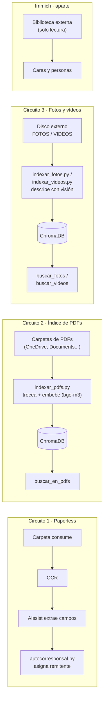

# IA local para gestión documental, imágenes y vídeo

## 1. Qué es y para quién

Un montaje doméstico de gestión documental y de fotos, autoalojado y con IA local: archiva y clasifica documentos automáticamente, permite preguntar por el contenido de tus PDFs y encontrar fotos y vídeos por lo que aparece en ellos, todo corriendo en tu propio PC, sin mandar tus documentos a la nube.

### ¿Es esto para ti?

No soy programador ni administrador de sistemas. Sé moverme por Windows, sigo
instrucciones de terminal sin miedo, leo lo que devuelve un comando y pregunto cuando
no entiendo algo. No sé escribir estos scripts desde cero y no habría sabido
diagnosticar la mitad de los fallos por mi cuenta: los he montado en conversación con
una IA, paso a paso, verificando cada uno.

Si ese es tu nivel, este repo te sirve: está escrito para que copies y pegues, y
explica el porqué de cada pieza.

Dos avisos honestos. El primero: a mí me llevó unas **35 horas repartidas en 8 sesiones
a lo largo de una semana**, y hay que tener paciencia con los callejones sin salida. El
segundo, más importante: al terminar tendrás un sistema más complejo de lo que puedes
mantener de memoria. Documenta tu montaje mientras lo haces — en este repo verás que la
guía de uso diaria fue de lo último y de lo más útil.

Si eres técnico, te sobrarán explicaciones; ve directo a los scripts y a la sección de
errores aprendidos.

## 2. Hardware y requisitos

Este montaje se ha probado en un PC Windows con GPU RTX 5080 (16 GB de VRAM), 32 GB de RAM del sistema y Docker Desktop. Es el hardware sobre el que están medidas todas las cifras de este README; no se ha probado con menos, así que no se afirma aquí un mínimo que no se haya comprobado.

VRAM y RAM cumplen papeles distintos aquí y no se pueden sustituir una por otra: la VRAM de la GPU es la que manda para los modelos de Ollama (si el modelo no cabe en VRAM, se descarga en CPU y se vuelve inutilizable, como se explica abajo); la RAM del sistema es la que usan Docker Desktop y el resto de contenedores del stack (Paperless-ngx, Immich, ChromaDB, LiteLLM...) funcionando a la vez.

Lo que sí se sabe con certeza: la VRAM es el límite real. `gpt-oss:20b` es el modelo más grande que cabe en 16 GB. Se probó `qwen3.6:35b`, que pedía unos 23 GB, y al no caber se descargaba en CPU — utilizable en teoría, pero demasiado lento en la práctica. Antes de elegir un modelo, comprueba su tamaño en VRAM contra el de tu GPU.

## 3. Arquitectura, con diagrama

Son tres circuitos independientes. Conviene explicarlo así desde el principio porque es lo que más confunde al empezar: no hay un único "pipeline", hay tres que no dependen entre sí.



1. **Paperless** — lo que se deja en la carpeta `consume` se OCR-iza, AIssist extrae los campos y `autocorresponsal.py` asigna el remitente.
2. **Índice de PDFs** — `indexar_pdfs.py` recorre las carpetas configuradas, trocea el texto, lo embebe con `bge-m3` y lo guarda en ChromaDB. Se consulta con `buscar_en_pdfs`.
3. **Fotos y vídeos** — `indexar_fotos.py` / `indexar_videos.py` describen cada archivo con el modelo de visión y lo indexan. Se consulta con `buscar_fotos` / `buscar_videos`.

Immich va aparte: caras y personas, sobre una biblioteca externa en solo lectura — no comparte datos con los otros tres circuitos.

### Piezas del stack

| Pieza | Dónde | Para qué |
|---|---|---|
| Paperless-ngx | Docker, puerto 8010 | Archivo documental |
| Paperless-AIssist | Docker, addon de Paperless | Extrae campos con LLM y visión |
| Ollama | Windows nativo, puerto 11434 | Sirve los modelos locales |
| Open WebUI | Docker | Interfaz de chat |
| ChromaDB | Fichero local | Búsqueda semántica |
| Immich | Docker, puerto 2283 | Fotos, caras, personas |
| ImmichMCP | Docker, puerto 5000 | Expone Immich como herramienta |
| LiteLLM | Docker, puerto 4000 | Pasarela a modelos de Google |
| mcpo | Windows, puertos 8001–8004 | Convierte MCP en OpenAPI para Open WebUI |
| OpenWhispr | Windows | Dictado por voz (Parakeet TDT 0.6B) |

**Puertos mcpo:** 8001 Paperless · 8002 PDFs · 8003 Fotos/Vídeos · 8004 Immich.

**Modelos Ollama en uso:** `gptoss-paperless` (gpt-oss:20b, `num_ctx` 16384, temp 0.1), `vl3-paperless` (qwen3-vl:8b, visión), `bge-m3` (embeddings de documentos), `nomic-embed-text` (embeddings de fotos y vídeos, heredado).

## 4. Instalación paso a paso, por bloques

### 4.0 Estructura de carpetas

Antes de tocar nada: elige una carpeta raíz para tu instalación (en este README la llamamos `<TU_RAIZ>`; el autor usa `D:\paperless` para todo lo de Paperless). Dentro de `<TU_RAIZ>` tienen que convivir, al mismo nivel:

```
<TU_RAIZ>\
  docker-compose.yml      ← copia de docker/paperless/docker-compose.yml
  .env                    ← copia de docker/paperless/.env.example, rellenada
  scripts\                ← todo el contenido de scripts/ de este repo
  chroma\                 ← la crea sola ChromaDB la primera vez que indexas
  data\ media\ export\ consume\   ← las crea sola Paperless al arrancar
```

Esto importa porque `docker-compose.yml` monta `./export` (relativo a su propia carpeta) y los scripts Python calculan su carpeta base como "la carpeta que contiene a `scripts\`" (`Path(__file__).resolve().parent.parent`, ver [scripts/indexar_pdfs.py](scripts/indexar_pdfs.py)). Si `docker-compose.yml` y `scripts\` no están en el mismo nivel, las dos rutas dejan de coincidir. Immich, ImmichMCP y LiteLLM son independientes: cada uno puede vivir en su propia carpeta (`docker/immich/`, `docker/immichmcp/`, `docker/litellm/` de este repo), sin relación con `<TU_RAIZ>`.

### 4.1 Docker Desktop

Instálalo y déjalo en marcha (con integración WSL2 si vas a usar la GPU para Immich).

### 4.2 Paperless-ngx + AIssist

1. Copia `docker/paperless/docker-compose.yml` y `docker/paperless/.env.example` a `<TU_RAIZ>`.
2. Renombra la copia de `.env.example` a `.env` y rellena `POSTGRES_PASSWORD` y `PAPERLESS_SECRET_KEY` con valores propios (nunca reutilices un ejemplo de un README).
3. Desde `<TU_RAIZ>`: `docker compose up -d`.

**⚠️ Aviso sobre el volumen de Docker:** `indexar_pdfs.py` aplica OCR copiando el PDF a `<TU_RAIZ>\export\ocr_auto` y luego ejecuta `ocrmypdf` **dentro** del contenedor `paperless-webserver-1`, sobre la ruta fija `/usr/src/paperless/export/ocr_auto/` (ver [scripts/indexar_pdfs.py:60-72](scripts/indexar_pdfs.py:60)). Esa ruta interna la define el bind mount `./export:/usr/src/paperless/export` del `docker-compose.yml`. Si sigues la estructura de carpetas de 4.0, coincide sola; si cambias el nombre del contenedor o el mapeo del volumen, tienes que actualizar también esa ruta dentro del script.

### 4.3 Immich

1. Copia `docker/immich/docker-compose.yml` y `.env.example` a una carpeta propia (p. ej. `<TU_RAIZ_IMMICH>`).
2. Rellena el `.env`: carpeta de subida, unidad de tu biblioteca externa de solo lectura, y credenciales de su base de datos.
3. `docker compose up -d`.

### 4.4 ImmichMCP

1. Copia `docker/immichmcp/docker-compose.yml` y `.env.example` a su propia carpeta.
2. Rellena `IMMICH_API_KEY` con una clave generada desde la interfaz de Immich (Ajustes → API Keys).
3. `docker compose up -d`.

### 4.5 LiteLLM (pasarela a Gemini)

1. Copia `docker/litellm/docker-compose.yml`, `config.yaml` y `.env.example` a su propia carpeta.
2. Rellena `GEMINI_API_KEY` con tu clave de Google AI Studio.
3. `docker compose up -d`.

### 4.6 Ollama y los modelos locales

Instala Ollama (nativo en Windows, no en Docker) y descarga los dos modelos base:

```
ollama pull gpt-oss:20b
ollama pull qwen3-vl:8b
ollama pull bge-m3
ollama pull nomic-embed-text
```

`bge-m3` y `nomic-embed-text` se usan tal cual, sin parámetros propios. Los otros dos necesitan un `Modelfile` para fijar el contexto a 16384 (Ollama lo deja en 4096 por defecto — ver sección 8) y otros parámetros de generación. Están en `ollama/`:

**`ollama/gptoss-paperless.Modelfile`**
```
FROM gpt-oss:20b
PARAMETER num_ctx 16384
PARAMETER temperature 0.1
```

**`ollama/vl3-paperless.Modelfile`**
```
FROM qwen3-vl:8b
PARAMETER num_ctx 16384
PARAMETER temperature 0.1
PARAMETER top_k 20
PARAMETER top_p 0.95
```

Crea los modelos personalizados a partir de esos archivos:

```
ollama create gptoss-paperless -f ollama/gptoss-paperless.Modelfile
ollama create vl3-paperless -f ollama/vl3-paperless.Modelfile
```

A partir de aquí, Open WebUI y los scripts ya pueden usar `gptoss-paperless` y `vl3-paperless` por su nombre.

### 4.7 ChromaDB

No necesita instalación ni contenedor propio: es la librería `chromadb` de Python, que cada script abre directamente sobre la carpeta `chroma\` (ver 4.0). Se crea sola la primera vez que ejecutas un script de indexado.

### 4.8 mcpo

Instalado con pip, sobre el mismo entorno Python que usan los scripts:

```bash
pip install mcpo
```

Versión usada: `0.0.20`.

Una vez instalado, cada `start-mcp-*.bat` de `scripts\` arranca su propio servidor (puertos documentados en la sección 3).

### 4.9 Secretos de los scripts

Copia `scripts/secrets.local.bat.example` a `scripts/secrets.local.bat` y rellena tu token real de Paperless (Ajustes → API Tokens en la interfaz de Paperless-ngx).

### 4.10 Tareas programadas

Ver sección 7 para el detalle de cómo engancharlas al Programador de tareas de Windows.

## 5. Los scripts

Todos viven en `scripts\`. Los lanzadores (`run-*.bat`, `run-*.vbs`, `start-mcp-*.bat`) se explican en la sección 7; aquí solo los scripts que hacen el trabajo real.

| Script | Qué hace |
|---|---|
| `autocorresponsal.py` | Lee el campo Proveedor/emisor de cada documento sin interlocutor asignado y crea/asigna el correspondiente en Paperless. Normaliza Unicode para no duplicar por tildes. |
| `buscar.py` | Búsqueda semántica por terminal sobre los PDFs indexados, para probar consultas sin pasar por Open WebUI. |
| `indexar_pdfs.py` | Indexa los PDFs de las carpetas configuradas. Si uno no tiene texto, le aplica OCR automático (copia de seguridad previa a `backup_pdfs`) y lo reintenta. |
| `mcp_pdfs.py` | Servidor MCP: expone `buscar_en_pdfs`, `listar_pdfs_indexados` y `abrir_pdf`. |
| `indexar_fotos.py` / `indexar_videos.py` | Indexan el disco externo. Los vídeos, con 3 fotogramas extraídos vía ffmpeg. Incremental: solo procesa lo nuevo. |
| `mcp_fotos.py` | Servidor MCP: expone `buscar_fotos`, `buscar_videos` y `estadisticas_fotos`; genera una galería HTML con los resultados. |
| `duplicados.py` | Detecta duplicados de fotos (SHA-256 + pHash) y vídeos (SHA-256) en el disco externo. Genera informe `.txt` y plan `.json`. No borra nada. |
| `revisar.py` | Genera un HTML interactivo para revisar a ojo los duplicados y descargar la lista de lo que se confirma borrar. |
| `limpiar.py` | Mueve a cuarentena los duplicados confirmados en `revision.html`. Nunca borra directamente; pide escribir "SI" para continuar. |
| `vigilante.py` | Vigila si el disco externo está conectado y si hay duplicados nuevos; solo abre `revision.html` cuando algo ha cambiado desde la última vez. |
| `organizar_fotos.py` | Reordena las fotos del disco externo en carpetas `AAAA\MM-Mes` según la fecha EXIF (o el nombre del archivo como respaldo). Por defecto solo simula; hace falta `--aplicar`. |
| `organizador.py` | Organiza la carpeta de Descargas por tipo de archivo (Imágenes, PDFs, Documentos, Instaladores...). |
| `oculto.vbs` | Lanza el `.bat` que se le pase como argumento sin mostrar ventana. |

*(Aviso: `buscar.py` y `organizador.py` no estaban en la tabla original de `CONTEXTO-PROYECTO.md` sección 4 — los añadí porque existen en `scripts\` y hacen algo distinto al resto.)*

## 6. Los prompts

Los dos prompts completos están en [`prompts/factura-aissist.md`](prompts/factura-aissist.md) y [`prompts/openwebui-gptoss.md`](prompts/openwebui-gptoss.md). Los ejemplos de dirección, número de factura y CIF que contenían se sustituyeron por otros inventados; el resto es el texto real usado en producción.

### `factura-aissist.md`

Es el prompt que usa **Paperless-AIssist** para leer cada documento nuevo y rellenar sus campos personalizados (importe, IVA, proveedor, fecha, si está pagado...) sin intervención manual. Esos campos son los que luego consume `autocorresponsal.py` (campo Proveedor) y las herramientas de Paperless en Open WebUI (campo Importe total).

### `openwebui-gptoss.md`

Es el *system prompt* del modelo `gptoss-paperless` en Open WebUI. Su trabajo es evitar que el modelo local conteste "no tengo acceso a eso" cuando sí tiene herramientas para averiguarlo, y que no confunda las cuatro fuentes distintas de información con las que puede toparse: Paperless (`tool_*`), PDFs sueltos de OneDrive (`buscar_en_pdfs`), el índice local de fotos/vídeos del disco externo (`buscar_fotos`/`buscar_videos`) y la biblioteca Immich (`immich_*`).

### Lecciones detrás de estas reglas

- **Importes como string con prefijo `EUR`** (`"EUR32.16"`, nunca `32,16 €` ni un número JSON) — para que el mismo formato sirva sin ambigüedad en dos sitios: como texto uniforme que Paperless guarda en el custom field, y como valor que las herramientas de Open WebUI parsean literalmente para sumar (paso 5 del system prompt: *"Su value tiene la forma 'EUR1129.00'"*). Un número JSON habría chocado con la coma decimal española; un string con el símbolo `€` habría sido más difícil de parsear de forma consistente entre OCR, AIssist y las herramientas.
- **El booleano "Pagado" exige `false` explícito, nunca `null`** — dejarlo en `null` deja el documento en un estado ambiguo ("sin dato" en vez de "no pagado"), lo que rompe cualquier filtro o consulta binaria posterior. Forzar `false` como valor por defecto convierte el campo en una pregunta que siempre tiene respuesta.
- **Límite de 110 caracteres en "Trabajos realizados"** — el prompt fuerza ese máximo porque es lo que funciona en la práctica; no está verificado de dónde sale exactamente el límite (no se afirma aquí que sea el límite de la base de datos de Paperless ni ningún otro origen concreto). Sin ese tope, AIssist tiende a generar descripciones largas que fallan al guardarse o se truncan a mitad de palabra.
- **Encadenar dos llamadas a herramienta en vez de pararse en la primera** — `gpt-oss:20b` tiende a conformarse con el primer resultado (la lista de interlocutores de `tool_list_correspondents_post`) y responder con eso, sin dar el segundo paso necesario (`tool_list_documents_post` con ese id) para llegar a los importes. El prompt tiene que decirlo de forma explícita ("Nunca te detengas después del paso 1") porque, dejado a su criterio, el modelo se detiene antes de tiempo. Es la otra cara de una lección ya recogida en la sección 8: activar más de una herramienta por chat suele hacer que el modelo llame a la que no toca: aquí el problema no es elegir mal, sino no encadenar cuando hace falta.

## 7. Automatización con tareas programadas

### Por qué `oculto.vbs`

El Programador de tareas de Windows, al ejecutar un `.bat` directamente, muestra brevemente una ventana de consola negra. `oculto.vbs` evita eso: es un lanzador genérico de un solo uso —

```vbs
Set s = CreateObject("WScript.Shell")
s.Run """" & WScript.Arguments(0) & """", 0, False
```

— que recibe la ruta de un `.bat` como argumento y lo ejecuta con ventana oculta (el `0`) sin esperar a que termine (el `False`). Se usa como acción de la tarea programada en vez de apuntar al `.bat` directamente.

### Cómo encadena cada lanzador

- **`run-autocorresponsal.vbs`** — no usa `oculto.vbs`, tiene su propio lanzador oculto integrado; simplemente ejecuta `run-autocorresponsal.bat` sin ventana. Ese `.bat` carga `secrets.local.bat` y ejecuta `autocorresponsal.py`.
- **`run-vigilante.vbs`** — ejecuta tres scripts en cadena, con una diferencia importante en el tercero:
  1. `vigilante.py`, **esperando** a que termine (comprueba si hay duplicados nuevos en el disco externo y abre `revision.html` solo si cambian).
  2. `indexar_fotos.py`, también **esperando**.
  3. `indexar_videos.py`, **sin esperar** — se lanza en segundo plano y la tarea programada se da por completada aunque el indexado de vídeos siga corriendo.
- **`run-indexar.bat`**, **`run-organizador.bat`** — cada uno llama a su script Python correspondiente; se lanzan a través de `oculto.vbs` para no mostrar consola.
- **`start-mcp-fotos.bat`**, **`start-mcp-pdfs.bat`**, **`start-mcp-immich.bat`**, **`start-mcpo.bat`** — arrancan cada servidor `mcpo` (quedan corriendo, no son tareas que terminen); también se lanzan a través de `oculto.vbs`.
- **`run-duplicados.bat`** — no tiene tarea programada propia. Es un lanzador manual para forzar una revisión de duplicados fuera del ciclo automático de `vigilante-duplicados` (que ya hace su propia comprobación llamando directamente a `revisar.py` desde `vigilante.py`).

### Las tareas programadas reales

Creadas con `schtasks` desde PowerShell como Administrador:

| Tarea | Acción | Disparador |
|---|---|---|
| `autocorresponsal` | `run-autocorresponsal.vbs` | Repetición cada 15 minutos |
| `vigilante-duplicados` | `run-vigilante.vbs` | Repetición cada 15 minutos |
| `indexar-pdfs` | `oculto.vbs` + `run-indexar.bat` | Al iniciar sesión |
| `organizador-descargas` | `oculto.vbs` + `run-organizador.bat` | Al iniciar sesión |
| `mcpo-paperless` | `oculto.vbs` + `start-mcpo.bat` | Al iniciar sesión |
| `mcp-pdfs` | `oculto.vbs` + `start-mcp-pdfs.bat` | Al iniciar sesión |
| `mcp-fotos` | `oculto.vbs` + `start-mcp-fotos.bat` | Al iniciar sesión |
| `mcp-immich` | `oculto.vbs` + `start-mcp-immich.bat` | Al iniciar sesión |

Todas se crean con las mismas banderas: `/ru <usuario> /rl highest /f` — se ejecutan como el usuario indicado, con privilegios máximos, y `/f` sobrescribe sin preguntar si la tarea ya existía (útil para volver a lanzar el mismo comando de creación sin que falle por duplicado).

## 8. Lo que aprendí a base de fallar

- **VRAM**: `gpt-oss:20b` es lo más grande que cabe en 16 GB. `qwen3.6:35b` pedía ~23 GB
  y descargaba en CPU. Comprobar el encaje antes de casarse con un modelo.
- **Ollama limita el contexto a 4096 por defecto.** Hay que crear un Modelfile con
  `num_ctx 16384` o los prompts largos fallan sin decir por qué.
- **Tesseract no lee tablas de color con poco contraste.** Ninguna opción de OCR lo
  arregla. Para eso hace falta un modelo de visión (`vl3-paperless`).
- **Pero visión no es la respuesta por defecto**: es lenta y puede inventar. Tesseract
  para todo, visión solo para lo que falle.
- **AIssist**: Process Tag y Processed Tag deben ser distintos (`ai-process` /
  `ai-processed`) o se entra en bucle infinito.
- **Embeddings**: `nomic-embed-text` está optimizado para inglés y rendía mal en
  español. `bge-m3` (1024 dim, coseno) lo resolvió.
- **Open WebUI**: las herramientas las conecta **el navegador**, así que la URL debe ser
  `localhost`. Las conexiones de modelos las hace el contenedor, y ahí va
  `host.docker.internal`. Esta inversión costó una tarde.
- **Una sola herramienta activada por chat**: con varias, el modelo local llama a la
  que no toca.
- **Modelos locales y mundo exterior**: `gpt-oss:20b` inventa y defiende lo inventado.
  Ningún prompt de anclaje lo arregla. Local para documentos propios, nube para el
  resto.
- **Gemini directo en Open WebUI** no pinta el texto (Google añade campos no estándar).
  LiteLLM de intermediario lo resuelve.
- **Cuotas de la capa gratuita de Google**: los modelos nuevos dan 20 peticiones/día;
  los `-lite` son mucho más generosos.
- **Verificar siempre importes y fechas** abriendo el documento. Por eso existe
  `abrir_pdf`.

## 9. Limitaciones y qué no hacer

### Qué no resuelve este montaje

- **No reconoce personas en fotos ni vídeos.** Los prompts de descripción (`indexar_fotos.py`, `indexar_videos.py`) instruyen explícitamente al modelo de visión: *"no inventes nombres de personas ni lugares"*. Nunca te dirá quién aparece en una foto. El reconocimiento de caras y personas es cosa de Immich (biblioteca aparte, herramientas `immich_*`), no de este índice.
- **El modelo local puede inventar.** `gpt-oss:20b` inventa cuando le preguntas algo que no está en tus documentos, y defiende lo inventado si insistes (sección 8). No lo uses como fuente de verdad fuera de tus propios archivos.
- **Ningún importe o fecha extraído automáticamente debe darse por bueno sin abrir el documento** — por eso existe la herramienta `abrir_pdf`.
- **La detección de duplicados nunca borra nada por sí sola.** `duplicados.py`/`revisar.py` generan un informe; `limpiar.py` solo mueve a cuarentena, y solo tras escribir "SI" explícitamente. Borrar de verdad es un paso manual tuyo, aparte.
- **No hay copia de seguridad automática de nada** — ni de la base de datos de Paperless, ni de ChromaDB, ni de las fotos. Este repo no incluye una estrategia de backup; tienes que montarla tú aparte.
- **Todo el stack asume español**: el OCR de Paperless está fijado a `spa`, y los prompts están escritos en español. Usarlo en otro idioma implica tocar configuración y prompts.
- **Es un único PC, sin redundancia.** Si está apagado, no hay indexado, ni Paperless, ni herramientas en Open WebUI.

### Avisos de seguridad

- Los secretos (token de Paperless, claves de Immich y de Google, `PAPERLESS_SECRET_KEY`, contraseña de Postgres) viven en archivos `.env` / `secrets.local.bat` que están en `.gitignore`. Nunca los subas al repositorio, ni siquiera en un commit temporal que luego borres — el historial de git los conservaría.
- No reutilices los valores de ejemplo de este README ni de los `.env.example`: genera los tuyos propios en cada instalación.
- Los puertos de Paperless (8010), mcpo (8001-8004) e Immich (2283) no llevan más autenticación que la propia de cada aplicación. Están pensados para tu red local; no los expongas a internet sin añadir tu propia capa de autenticación o VPN.
- Si un secreto llega a aparecer en un chat, una captura de pantalla o un log que no controlas del todo, trátalo como comprometido y rótalo — aunque nunca haya llegado a publicarse. Es justo lo que pasó con `PAPERLESS_SECRET_KEY` al preparar este repo.

## 10. Guía de uso diaria

### Chuleta: qué modelo y qué herramienta

| Quiero... | Modelo | Herramienta activada |
|---|---|---|
| Consultar facturas y recibos | `gptoss-paperless` | Paperless |
| Consultar informes, pólizas, trámites | `gptoss-paperless` | PDFs OneDrive |
| Buscar fotos o vídeos del disco externo | `gptoss-paperless` | Fotos Disco Externo |
| Buscar fotos por persona o cara | `gptoss-paperless` | Immich |
| Preguntar cosas del mundo | `gemini-flash` | *ninguna* |
| Charlar o preguntas rápidas | `gemma` | *ninguna* |
| Algo que necesite más calidad | `gemini-pro` | *ninguna* |

> **Activa solo la herramienta que necesites.** Con varias a la vez el modelo local se lía y llama a la que no toca.

### 1. Archivar una factura, recibo o documento oficial

**Qué hago:** copio el archivo (PDF, JPG, lo que sea) a `<TU_RAIZ>\consume`.

**Qué pasa solo:** Paperless lo lee, AIssist le saca los datos (proveedor, importe, fecha, nº de factura) y otro script le asigna el remitente. Tarda unos minutos.

**Dónde lo veo:** en Paperless, `http://localhost:8010`.

**Cómo lo consulto hablando:** Open WebUI, modelo `gptoss-paperless`, herramienta **Paperless**. Ej.: *"¿cuánto pagué en la última factura del agua?"*

> Verifica siempre los importes abriendo el documento. El modelo local se equivoca.

### 2. Guardar un informe médico, póliza, trámite… para poder preguntarle luego

**Qué hago:** guardo el PDF en `%USERPROFILE%\Documents\Documentos para indexar`.

**Qué pasa solo:** al arrancar el PC se indexa el contenido.

**Si tengo prisa, lo fuerzo:**
```
%USERPROFILE%\AppData\Local\Python\bin\python.exe <TU_RAIZ>\scripts\indexar_pdfs.py
```

**Cómo lo consulto:** Open WebUI, modelo `gptoss-paperless`, herramienta **PDFs OneDrive**. Ej.: *"¿qué dice el informe del traumatólogo?"*

> Solo indexa **PDF**. Si escaneas en JPG, no entra aquí.
> Si el PDF viene escaneado sin texto, hay que pasarle OCR (ver punto 7).

### 3. Buscar una foto o un vídeo del disco externo

**Qué hago:** nada, ya está indexado.

**Cómo lo consulto:** Open WebUI, modelo `gptoss-paperless`, herramienta **Fotos Disco Externo**. Ej.: *"fotos de la playa con niños"*. Se abre una galería en el navegador.

### 4. Buscar fotos por persona / cara

**Dónde:** Immich, `http://localhost:2283`.

**O hablando:** Open WebUI, modelo `gptoss-paperless`, herramienta **Immich**.

### 5. Dictar en vez de escribir

**Cómo:** pulso **Ctrl+Alt+K** (o el botón del ratón), hablo, se escribe donde tenga el cursor.

Lo hace OpenWhispr con el modelo **Parakeet TDT 0.6B**. No depende de Open WebUI.

### 6. Preguntar cosas del mundo (noticias, productos, cómo se hace algo)

**No uses el modelo local.** Se inventa cosas y las defiende. El modelo local es para **tus documentos**, donde acierta y puedes comprobarlo abriendo el archivo.

En el selector, elige uno de los de Google (van por LiteLLM, sin herramientas activadas):

| Modelo | Para qué | Detrás está |
|---|---|---|
| `gemini-flash` | Uso diario: buscar, resumir, explicar | `gemini-3.5-flash-lite` |
| `gemini-pro` | Cuando quiero más calidad | `gemini-3.1-flash-lite` |
| `gemma` | Charla y preguntas rápidas | `gemma-4-31b-it` |

> Son de capa gratuita y tienen cuota diaria. Si sale un error **429**, es que se agotó: cambia de modelo o espera.

### 7. Un PDF escaneado no se puede buscar (no tiene texto)

**No hay que hacer nada.** El indexador lo detecta, le aplica OCR y lo indexa, todo solo.

Antes de tocarlo guarda una copia del original en `<TU_RAIZ>\backup_pdfs`.

> Si dice *digital signature*: está firmado digitalmente y no se toca. Esos ya suelen traer texto.

### 8. Algo no funciona en Open WebUI (no aparecen las herramientas)

Casi siempre es que un servicio no arrancó. Comprobar:

```
netstat -ano | findstr ":8001 :8002 :8003 :8004"
```

Deben salir los cuatro. Si falta alguno, lanzarlo a mano:

| Puerto | Herramienta | Arrancar con |
|---|---|---|
| 8001 | Paperless | `<TU_RAIZ>\scripts\start-mcpo.bat` |
| 8002 | PDFs OneDrive | `<TU_RAIZ>\scripts\start-mcp-pdfs.bat` |
| 8003 | Fotos Disco Externo | `<TU_RAIZ>\scripts\start-mcp-fotos.bat` |
| 8004 | Immich | `<TU_RAIZ>\scripts\start-mcp-immich.bat` |

> Todos tienen tarea programada al iniciar sesión. Si uno falla siempre, hay que revisar su tarea.

### 9. Reglas que ya me han costado tiempo

- Las herramientas de Open WebUI se conectan con **`localhost`**, nunca con `host.docker.internal`. (Los modelos, al revés.)
- Después de reiniciar el PC, dar un minuto antes de usar nada: los servicios tardan en levantar.
- Las carpetas que se indexan son solo dos: `OneDrive\Documentos` y `Documents\Documentos para indexar`. Lo demás no existe para el buscador.
- Una sola herramienta activada a la vez.
- Los modelos de Google se configuran en el `config.yaml` de LiteLLM; tras cambiarlo, `docker compose restart`.
- Antes de borrar cualquier cosa, hacer copia.

## 11. Agradecimientos y licencia

### Agradecimientos

Todo este montaje se ha construido en conversación con **Claude** (Anthropic), en unas
35 horas repartidas en 8 sesiones: diagnóstico de fallos, scripts, prompts y
documentación.

El mérito de Claude está en no haberme dejado solo ante los mensajes de error a las
once de la noche. Los aciertos son compartidos; los fallos, todos míos, y varios de
los suyos están apuntados en la sección «Lo que aprendí a base de fallar».

### Licencia

- El código (`scripts/`, `docker/`) está bajo licencia **MIT** — ver [LICENSE](LICENSE).
- La documentación (este README y `prompts/`) está bajo licencia **CC BY 4.0** — ver [LICENSE-docs](LICENSE-docs).
