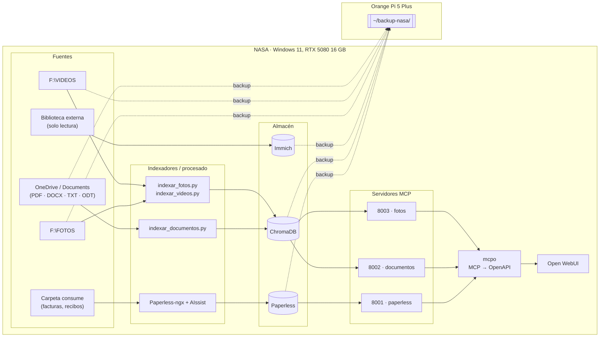
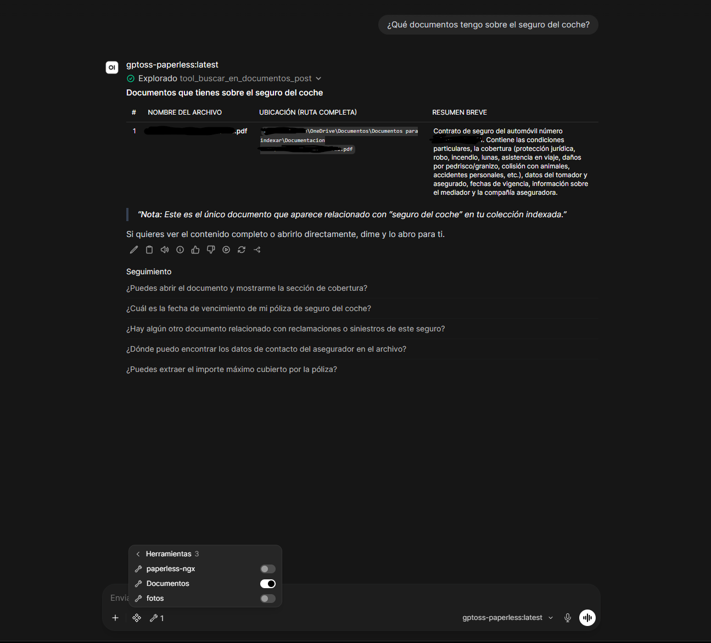
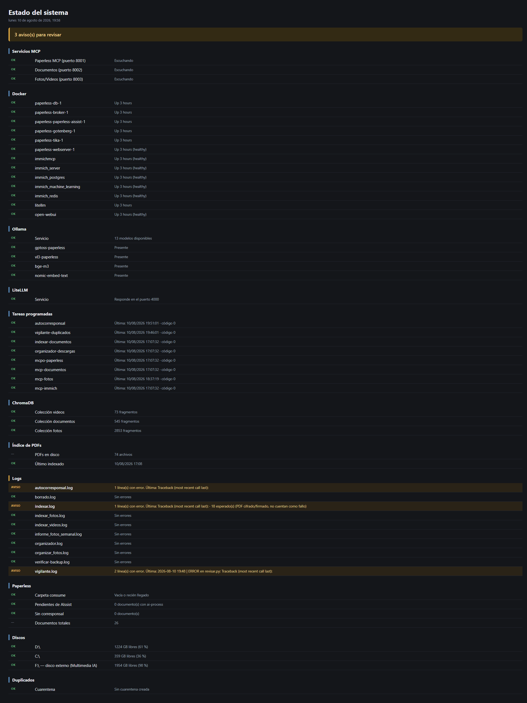
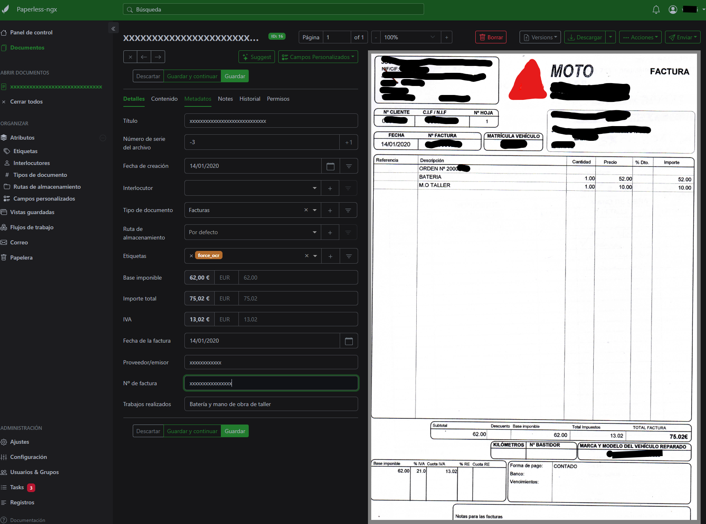
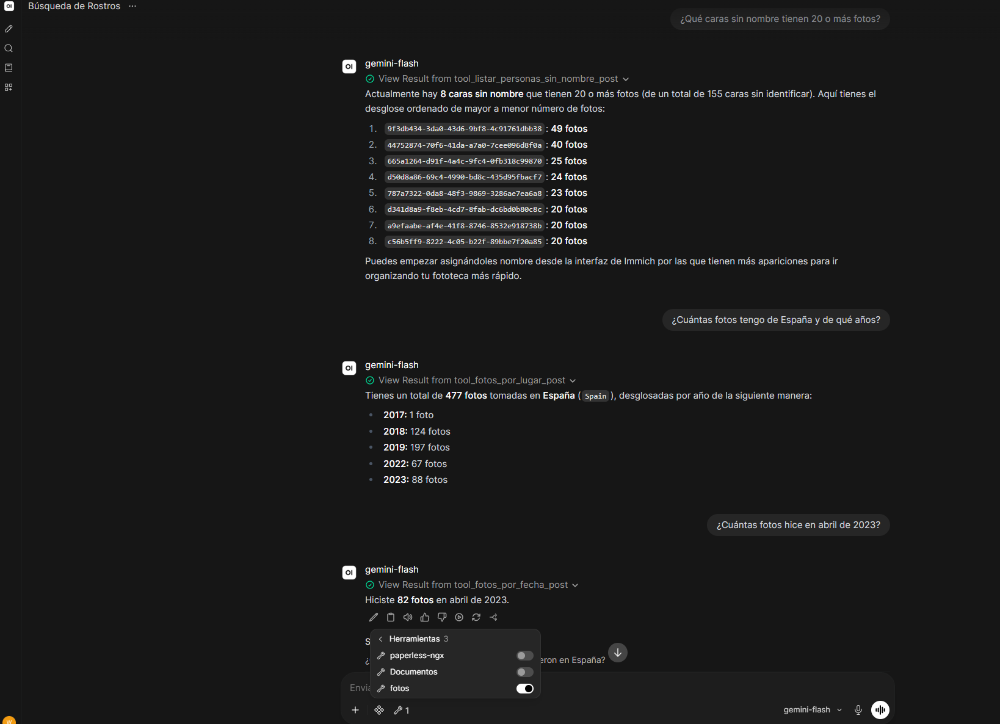
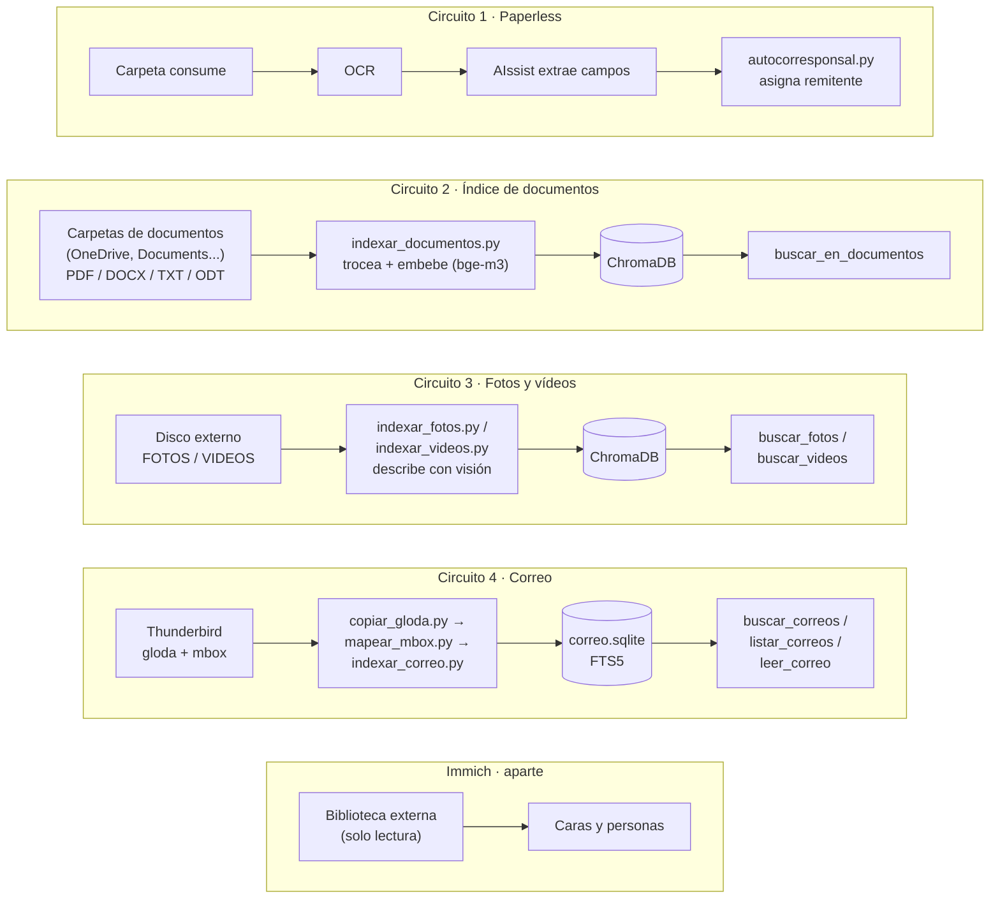

[Español](README.md) · [English](README.en.md)

# IA local para gestión documental, imágenes y vídeo

> Gestión documental y de fotos, autoalojada y con IA local: archiva, indexa y busca por contenido en tu propio PC, sin mandar tus documentos a la nube.

[](LICENSE)
[](LICENSE-docs)
[](requirements.txt)
[](docker)


## El stack, de un vistazo



| Nodo | SO / Arquitectura | Servicios | Rutas de datos | Puertos |
|---|---|---|---|---|
| NASA | Windows 11, x86_64, RTX 5080 16 GB | Ollama, Open WebUI, LiteLLM, SearXNG, Paperless-ngx, ChromaDB (`PersistentClient`), Immich, mcpo (filesystem / Paperless / documentos / fotos / correo) | `D:\paperless`, `D:\paperless\chroma`, `D:\immich` | 11434 (Ollama) · 4000 (LiteLLM) · 8080 (SearXNG) · 8010 (Paperless-ngx) · 2283 (Immich) · 8000 (mcpo filesystem) · 8001 (mcpo Paperless) · 8002 (mcpo documentos) · 8003 (mcpo fotos) · 8005 (mcpo correo) |
| Orange Pi 5 Plus | Linux, ARM64 | Destino de backups | `~/backup-nasa/` (export de Paperless, ChromaDB, fotos, vídeos, volumen de Open WebUI) | — |

Immich es un circuito aparte (caras y personas, biblioteca externa en solo lectura) y no entra en este diagrama simplificado — el desglose completo de los tres circuitos y por qué son independientes está en la sección 3.

## Capturas

| | |
|---|---|
|  |  |
|  |  |

## Documentación

- [Restauración de backups, procedimiento verificado](docs/restauracion-backups.md) — los 6 bloques del backup (ChromaDB, fotos, vídeos, documentos, base de datos de Immich, volumen de Open WebUI), con el procedimiento real de restauración y el resultado de cada prueba.

## 1. Qué es y para quién

Un montaje doméstico de gestión documental y de fotos, autoalojado y con IA local: archiva y clasifica documentos automáticamente, permite preguntar por el contenido de tus PDFs y encontrar fotos y vídeos por lo que aparece en ellos, todo corriendo en tu propio PC, sin mandar tus documentos a la nube.

### ¿Es esto para ti?

Tengo 64 años y no soy programador. Si yo he podido montarlo, probablemente tú también.

No soy programador ni administrador de sistemas. Sé moverme por Windows, sigo
instrucciones de terminal sin miedo, leo lo que devuelve un comando y pregunto cuando
no entiendo algo. No sé escribir estos scripts desde cero y no habría sabido
diagnosticar la mitad de los fallos por mi cuenta: los he montado en conversación con
una IA, paso a paso, verificando cada uno.

Si ese es tu nivel, este repo te sirve: está escrito para que copies y pegues, y
explica el porqué de cada pieza.

Dos avisos honestos. El primero: a mí me llevó unas **35 horas repartidas en 8 sesiones
a lo largo de una semana**, y hay que tener paciencia con los callejones sin salida. El
segundo, más importante: al terminar tendrás un sistema más complejo de lo que puedes
mantener de memoria. Documenta tu montaje mientras lo haces — en este repo verás que la
guía de uso diaria fue de lo último y de lo más útil.

Si eres técnico, te sobrarán explicaciones; ve directo a los scripts y a la sección de
errores aprendidos.

## 2. Hardware y requisitos

Este montaje se ha probado en un PC Windows con GPU RTX 5080 (16 GB de VRAM), 32 GB de RAM del sistema y Docker Desktop. Es el hardware sobre el que están medidas todas las cifras de este README; no se ha probado con menos, así que no se afirma aquí un mínimo que no se haya comprobado.

VRAM y RAM cumplen papeles distintos aquí y no se pueden sustituir una por otra: la VRAM de la GPU es la que manda para los modelos de Ollama (si el modelo no cabe en VRAM, se descarga en CPU y se vuelve inutilizable, como se explica abajo); la RAM del sistema es la que usan Docker Desktop y el resto de contenedores del stack (Paperless-ngx, Immich, ChromaDB, LiteLLM...) funcionando a la vez.

Lo que sí se sabe con certeza: la VRAM es el límite real. `gpt-oss:20b` es el modelo más grande que cabe en 16 GB. Se probó `qwen3.6:35b`, que pedía unos 23 GB, y al no caber se descargaba en CPU — utilizable en teoría, pero demasiado lento en la práctica. Antes de elegir un modelo, comprueba su tamaño en VRAM contra el de tu GPU.

## 3. Arquitectura, con diagrama

Son cuatro circuitos independientes. Conviene explicarlo así desde el principio porque es lo que más confunde al empezar: no hay un único "pipeline", hay cuatro que no dependen entre sí.



1. **Paperless** — lo que se deja en la carpeta `consume` se OCR-iza, AIssist extrae los campos y `autocorresponsal.py` asigna el remitente.
2. **Índice de documentos** — `indexar_documentos.py` recorre las carpetas configuradas, trocea el texto, lo embebe con `bge-m3` y lo guarda en ChromaDB. Soporta PDF, DOCX, TXT y ODT.
3. **Fotos y vídeos** — `indexar_fotos.py` / `indexar_videos.py` describen cada archivo con el modelo de visión y lo indexan. Se consulta con `buscar_fotos` / `buscar_videos`.
4. **Correo** — `copiar_gloda.py` copia el índice de Thunderbird, `mapear_mbox.py` resuelve carpetas vía `prefs.js` e `indexar_correo.py` construye `correo.sqlite` con FTS5. Solo lectura: no envía, borra ni mueve nada. Se consulta con `buscar_correos` / `listar_correos` / `leer_correo`.

Immich va aparte: caras y personas, sobre una biblioteca externa en solo lectura — no comparte datos con los otros cuatro circuitos.

### Piezas del stack

| Pieza | Dónde | Para qué |
|---|---|---|
| Paperless-ngx | Docker, puerto 8010 | Archivo documental |
| Paperless-AIssist | Docker, addon de Paperless | Extrae campos con LLM y visión |
| Ollama | Windows nativo, puerto 11434 | Sirve los modelos locales |
| Open WebUI | Docker | Interfaz de chat |
| ChromaDB | Fichero local | Búsqueda semántica |
| Immich | Docker, puerto 2283 | Fotos, caras, personas |
| LiteLLM | Docker, puerto 4000 | Pasarela a modelos de Google |
| mcpo | Windows, puertos 8001–8003 y 8005 | Convierte MCP en OpenAPI para Open WebUI |
| OpenWhispr | Windows | Dictado por voz (Parakeet TDT 0.6B) |

**Puertos mcpo:** 8001 Paperless · 8002 Documentos · 8003 Fotos/Vídeos · 8005 Correo.

**Acceso desde la red:** mcpo (8001-8003, 8005) y LiteLLM (4000) escuchan solo en `127.0.0.1` — no alcanzables desde otros dispositivos. Paperless (8010) e Immich (2283) sí son accesibles en tu red local (detalle en la sección 9).

**Modelos Ollama en uso:** `gptoss-paperless` (gpt-oss:20b, `num_ctx` 16384, temp 0.1), `vl3-paperless` (qwen3-vl:8b, visión), `bge-m3` (embeddings de documentos), `nomic-embed-text` (embeddings de fotos y vídeos, heredado).

## 4. Instalación paso a paso, por bloques

### 4.0 Estructura de carpetas

Antes de tocar nada: elige una carpeta raíz para tu instalación (en este README la llamamos `<TU_RAIZ>`; el autor usa `D:\paperless` para todo lo de Paperless). Dentro de `<TU_RAIZ>` tienen que convivir, al mismo nivel:

```
<TU_RAIZ>\
  docker-compose.yml      ← copia de docker/paperless/docker-compose.yml
  .env                    ← copia de docker/paperless/.env.example, rellenada
  scripts\                ← todo el contenido de scripts/ de este repo
  chroma\                 ← la crea sola ChromaDB la primera vez que indexas
  data\ media\ export\ consume\   ← las crea sola Paperless al arrancar
```

Esto importa porque `docker-compose.yml` monta `./export` (relativo a su propia carpeta) y los scripts Python calculan su carpeta base como "la carpeta que contiene a `scripts\`" (`Path(__file__).resolve().parent.parent`, ver [scripts/config_rutas.py](scripts/config_rutas.py), de donde lo importan `indexar_documentos.py`, `mcp_documentos.py`, `buscar.py`, `salud.py`, `indexar_fotos.py`, `indexar_videos.py`, `mcp_fotos.py` y `limpiar.py`). Si `docker-compose.yml` y `scripts\` no están en el mismo nivel, las dos rutas dejan de coincidir. Immich y LiteLLM son independientes: cada uno puede vivir en su propia carpeta (`docker/immich/`, `docker/litellm/` de este repo), sin relación con `<TU_RAIZ>`.

### 4.1 Docker Desktop

Instálalo y déjalo en marcha (con integración WSL2 si vas a usar la GPU para Immich).

### 4.2 Paperless-ngx + AIssist

1. Copia `docker/paperless/docker-compose.yml` y `docker/paperless/.env.example` a `<TU_RAIZ>`.
2. Renombra la copia de `.env.example` a `.env` y rellena `POSTGRES_PASSWORD` y `PAPERLESS_SECRET_KEY` con valores propios (nunca reutilices un ejemplo de un README).
3. Desde `<TU_RAIZ>`: `docker compose up -d`.

**⚠️ Aviso sobre el volumen de Docker:** `indexar_documentos.py` aplica OCR copiando el PDF a `<TU_RAIZ>\export\ocr_auto` y luego ejecuta `ocrmypdf` **dentro** del contenedor `paperless-webserver-1`, sobre la ruta fija `/usr/src/paperless/export/ocr_auto/` (ver [scripts/indexar_documentos.py:102-117](scripts/indexar_documentos.py:102)). Esa ruta interna la define el bind mount `./export:/usr/src/paperless/export` del `docker-compose.yml`. Si sigues la estructura de carpetas de 4.0, coincide sola; si cambias el nombre del contenedor o el mapeo del volumen, tienes que actualizar también esa ruta dentro del script.

### 4.3 Immich

1. Copia `docker/immich/docker-compose.yml` y `.env.example` a una carpeta propia (p. ej. `<TU_RAIZ_IMMICH>`).
2. Rellena el `.env`: carpeta de subida, unidad de tu biblioteca externa de solo lectura, y credenciales de su base de datos.
3. `docker compose up -d`.

### 4.4 LiteLLM (pasarela a Gemini)

1. Copia `docker/litellm/docker-compose.yml`, `config.yaml` y `.env.example` a su propia carpeta.
2. Rellena `GEMINI_API_KEY` con tu clave de Google AI Studio.
3. `docker compose up -d`.

### 4.5 Ollama y los modelos locales

Instala Ollama (nativo en Windows, no en Docker) y descarga estos cuatro modelos base:

```
ollama pull gpt-oss:20b
ollama pull qwen3-vl:8b
ollama pull bge-m3
ollama pull nomic-embed-text
```

`bge-m3` y `nomic-embed-text` se usan tal cual, sin parámetros propios. Los otros dos necesitan un `Modelfile` para fijar el contexto a 16384 (Ollama lo deja en 4096 por defecto — ver sección 8) y otros parámetros de generación. Están en `ollama/`:

**`ollama/gptoss-paperless.Modelfile`**
```
FROM gpt-oss:20b
PARAMETER num_ctx 16384
PARAMETER temperature 0.1
```

**`ollama/vl3-paperless.Modelfile`**
```
FROM qwen3-vl:8b
PARAMETER num_ctx 16384
PARAMETER temperature 0.1
PARAMETER top_k 20
PARAMETER top_p 0.95
```

Crea los modelos personalizados a partir de esos archivos:

```
ollama create gptoss-paperless -f ollama/gptoss-paperless.Modelfile
ollama create vl3-paperless -f ollama/vl3-paperless.Modelfile
```

A partir de aquí, Open WebUI y los scripts ya pueden usar `gptoss-paperless` y `vl3-paperless` por su nombre.

**Antes de borrar modelos para liberar espacio**, estos nunca deben tocarse porque son la base de un modelo personalizado o los usan los indexadores directamente:

- `gpt-oss:20b` — base de `gptoss-paperless`.
- `qwen3-vl:8b` — base de `vl3-paperless`.
- `qwen2.5-coder:14b` — base de `qwen2.5-coder:14b-32k`.
- `bge-m3` — embeddings de `indexar_documentos.py`/`mcp_documentos.py`.
- `nomic-embed-text` — embeddings de `indexar_fotos.py`/`indexar_videos.py`/`mcp_fotos.py`.

**`ollama list` puede dar tamaños engañosos.** Dos nombres distintos pueden compartir exactamente el mismo blob en disco si son el mismo modelo sin cambios — el ID es el que lo delata, no el nombre. Por ejemplo, en una instalación real `gptoss-paperless` y otro modelo sin relación (`web-search`) compartían ID (`1efcb56daf08`, 13 GB): son el mismo fichero en disco con dos nombres, borrar uno con `ollama rm` no libera esos 13 GB si el otro nombre lo sigue referenciando. Antes de borrar algo para liberar espacio, comprueba con `ollama list` si su ID se repite en otro nombre que quieras conservar.

### 4.6 ChromaDB

No necesita instalación ni contenedor propio: es la librería `chromadb` de Python, que cada script abre directamente sobre la carpeta `chroma\` (ver 4.0). Se crea sola la primera vez que ejecutas un script de indexado.

### 4.7 Dependencias Python

Todos los scripts de `scripts\` y `mcpo` corren sobre el mismo Python que usan los `.bat`: **Python 3.14**, instalado en `%USERPROFILE%\AppData\Local\Python\pythoncore-3.14-64` (el ejecutable que invocan los lanzadores es `...\bin\python.exe`).

Instala todo de una vez, con las versiones exactas que corren hoy en la instalación real — verificadas contra `pip freeze`, mismo criterio que los digests de Docker: congelar lo que funciona, no abrir rangos:

```bash
%USERPROFILE%\AppData\Local\Python\bin\python.exe -m pip install -r requirements.txt
```

Ver [`requirements.txt`](requirements.txt) para el detalle de qué usa cada script.

### 4.8 mcpo

Se instala junto con el resto en `requirements.txt` (sección anterior). Versión usada: `0.0.20`.

Una vez instalado, cada `start-mcp-*.bat` de `scripts\` arranca su propio servidor (puertos documentados en la sección 3).

### 4.9 Secretos de los scripts

Copia `scripts/secrets.local.bat.example` a `scripts/secrets.local.bat` y rellena tu token real de Paperless (Ajustes → API Tokens en la interfaz de Paperless-ngx) y tu clave de Immich (Ajustes → API Keys) — esta última la usan las tools de Immich de `mcp_fotos.py` (`listar_personas`, `listar_personas_sin_nombre`, `fotos_por_lugar`, `fotos_por_fecha`), basta con permisos de solo lectura (`person.read`, `asset.read`, `face.read`).

### 4.10 Tareas programadas

Ver sección 7 para el detalle de cómo engancharlas al Programador de tareas de Windows.

### 4.11 Aider con fallback local (opcional)

Esto no es parte del montaje que usa el día a día: es la herramienta que el autor usa para editar el propio código de este repo desde WSL. Se documenta por si te sirve para tu caso, no hace falta para que el resto del stack funcione.

**Cuándo usarlo:** cuando se agotan los tokens de Claude a mitad de sesión y hace falta seguir editando código sin esperar. No es un sustituto habitual: es solo para tapar el hueco.

**Cómo configurarlo:**
1. Copia [aider/.aider.conf.yml.example](aider/.aider.conf.yml.example) a tu proyecto (o a tu `$HOME`), renómbralo (por ejemplo `.aider.conf.yml.local`) y rellena la IP de tu WSL siguiendo las instrucciones del propio archivo.
2. Asegúrate de tener el modelo descargado: `ollama pull qwen2.5-coder:14b-32k`.
3. Lánzalo explícitamente con `aider -c .aider.conf.yml.local` — Aider no cambia de modelo solo, la elección es siempre manual.

**Limitaciones, en serio:** `qwen2.5-coder:14b` es muy inferior a Claude para tareas que tocan varios archivos o requieren entender contexto amplio del proyecto. Úsalo solo para cambios acotados y prompts simples, y revisa siempre el código que genere antes de aceptarlo — con un modelo de este tamaño, más que con Claude.

## 5. Los scripts

Todos viven en `scripts\`. Los lanzadores (`run-*.bat`, `run-*.vbs`, `start-mcp-*.bat`) se explican en la sección 7; aquí solo los scripts que hacen el trabajo real.

| Script | Qué hace |
|---|---|
| `autocorresponsal.py` | Lee el campo Proveedor/emisor de cada documento sin interlocutor asignado y crea/asigna el correspondiente en Paperless. Normaliza Unicode para no duplicar por tildes. |
| `buscar.py` | Búsqueda semántica por terminal sobre los PDFs indexados, para probar consultas sin pasar por Open WebUI. |
| `config_rutas.py` | Sin ejecutable propio: constantes de rutas y configuración compartidas por doce scripts — documentos (`indexar_documentos.py`, `mcp_documentos.py`, `buscar.py`, `salud.py`: `CARPETAS_PDFS`, `CARPETA_DB`, `MODELO`, `EXTENSIONES`...) y fotos/vídeos (`indexar_fotos.py`, `indexar_videos.py`, `mcp_fotos.py`, `limpiar.py`: `OLLAMA_BASE`, `MODELO_VISION`, `MODELO_EMBED_FOTOS`) y correo (`copiar_gloda.py`, `mapear_mbox.py`, `indexar_correo.py`, `mcp_correo.py`: `perfil_tb()`, `RUTA_GLODA`) — para no mantener copias sueltas de cada una. |
| `indexar_documentos.py` | Indexa PDF, DOCX, TXT y ODT de las carpetas configuradas. Si un PDF no tiene texto, le aplica OCR automático (copia de seguridad previa a `backup_pdfs`) y lo reintenta — DOCX/TXT/ODT nunca necesitan OCR, siempre traen texto nativo. |
| `mcp_documentos.py` | Servidor MCP: expone `buscar_en_documentos`, `listar_documentos_indexados`, `abrir_documento` (restringido a las carpetas indexadas: rechaza con un mensaje claro cualquier ruta fuera de ellas) y `contar_documentos`. |
| `indexar_fotos.py` / `indexar_videos.py` | Indexan el disco externo. Los vídeos, con 3 fotogramas extraídos vía ffmpeg. Incremental: solo procesa lo nuevo. |
| `mcp_fotos.py` | Servidor MCP: expone `buscar_fotos`, `buscar_videos`, `estadisticas_fotos`, `listar_personas`, `listar_personas_sin_nombre`, `fotos_por_lugar` y `fotos_por_fecha` (las cuatro últimas filtran y cuentan en código en vez de mandarle al modelo el JSON crudo de Immich, mismo motivo que `contar_documentos` — parámetros y detalle de cada una, justo debajo); genera una galería HTML con los resultados de las búsquedas. |
| `copiar_gloda.py` | Copia `global-messages-db.sqlite` del perfil de Thunderbird a una copia de solo lectura, para leerla sin pelearse con el lock de Thunderbird. |
| `mapear_mbox.py` | Resuelve la correspondencia entre carpetas de gloda y ficheros mbox en disco usando las claves de `prefs.js`. |
| `indexar_correo.py` | Construye `correo.sqlite` con índice FTS5 a partir de gloda y los mbox. Incremental. |
| `mcp_correo.py` | Servidor MCP (puerto 8005): expone `buscar_correos`, `listar_correos`, `leer_correo`, `contar_correos`, `listar_cuentas` y `describir_cuentas`. Solo lectura. Cada correo incluye un enlace `mid:` que abre el mensaje en Thunderbird. |
| `duplicados.py` | Detecta duplicados de fotos (SHA-256 + pHash) y vídeos (SHA-256) en el disco externo. Genera informe `.txt` y plan `.json`. No borra nada. |
| `revisar.py` | Genera un HTML interactivo para revisar a ojo los duplicados y descargar la lista de lo que se confirma borrar. |
| `limpiar.py` | Mueve a cuarentena los duplicados confirmados en `revision.html`. Nunca borra directamente; pide escribir "SI" para continuar. |
| `vigilante.py` | Vigila si el disco externo está conectado y si hay duplicados nuevos; solo abre `revision.html` cuando algo ha cambiado desde la última vez. |
| `organizar_fotos.py` | Reordena las fotos del disco externo en carpetas `AAAA\MM-Mes` según la fecha EXIF (o el nombre del archivo como respaldo). Por defecto solo simula; hace falta `--aplicar`. |
| `informe_fotos_semanal.ps1` | Ejecuta `organizar_fotos.py` en modo simulación, extrae de su informe solo la fecha, la cifra de «Ya en su sitio» / «A mover» y las 3 carpetas con más ficheros, y muestra un toast nativo de Windows si hay algo que mover (nunca lee la sección `### MOVIMIENTOS`, ni lanza toast si no hay nada que mover). |
| `organizador.py` | Organiza la carpeta de Descargas por tipo de archivo (Imágenes, PDFs, Documentos, Instaladores...). |
| `oculto.vbs` | Lanza el `.bat` que se le pase como argumento sin mostrar ventana. |
| `backup-orangepi.bat` | Copia Paperless, ChromaDB, fotos, vídeos, las dos carpetas de documentos a indexar (`Documents` y OneDrive), la base de datos de Immich y el volumen de Open WebUI a un NAS/Orange Pi por red (`scp`/`rsync`/`pg_dump`/`docker run` vía WSL). Sin tarea programada propia; ver «Qué no resuelve este montaje» en la sección 9 para el detalle y las limitaciones. |
| `salud.py` | Comprueba el estado de todo el stack (puertos mcpo, contenedores Docker, Ollama, LiteLLM, tareas programadas, ChromaDB, carpeta `consume`, disco externo, cuarentena de duplicados...) y genera `salud.html` con el resultado. Se ejecuta a mano con `salud.bat`, no tiene tarea programada. |

`salud.html`, el informe que genera, se regenera en cada ejecución dentro de `scripts\` y no se versiona (está en `.gitignore`). **Es sensible**: enumera tareas programadas, contenedores Docker, versiones de modelos, espacio libre en disco y estado de la carpeta `consume` — un inventario bastante completo de tu instalación. No lo compartas ni lo subas a ningún sitio.

### Tools de `mcp_fotos.py` (puerto 8003)

Las tres últimas (`listar_personas_sin_nombre`, `fotos_por_lugar`, `fotos_por_fecha`) consultan la API de Immich directamente — sin LLM ni ChromaDB de por medio — y nunca devuelven rutas, nombres de archivo ni miniaturas, solo cifras e IDs.

| Tool | Parámetros | Qué devuelve | Cuándo usarla |
|---|---|---|---|
| `buscar_fotos` | `consulta: str`, `maximo: int = 12` | Abre una galería HTML con las fotos más parecidas a la consulta (miniatura, ruta, distancia). | Buscar fotos por lo que aparece en ellas (personas, lugares, objetos, escenas). |
| `buscar_videos` | `consulta: str`, `maximo: int = 12` | Igual que `buscar_fotos`, pero sobre vídeos. | Buscar vídeos por contenido. |
| `estadisticas_fotos` | ninguno | Total indexado y desglose por carpeta y por año, para fotos y vídeos. | "Cuántas fotos/vídeos tengo indexados y de qué años." |
| `listar_personas` | ninguno | Nombre y nº de fotos de cada persona **con nombre** en Immich. Sin IDs, miniaturas ni rutas. | "Qué personas tengo etiquetadas" / "cuántas fotos hay de X". |
| `listar_personas_sin_nombre` | `min_fotos: int = 20` | ID y nº de fotos de cada cara **sin nombre** en Immich, de más a menos fotos. | Decidir qué caras sin identificar merece la pena nombrar o fusionar primero (ver «Fusionar personas duplicadas» en la sección 9). |
| `fotos_por_lugar` | `lugar: str`, `anio: int \| None = None` | Conteo total de fotos de ese lugar (`city`/`country` del EXIF vía Immich), desglosado por año o, si se indica `anio`, por mes. | "Cuántas fotos tengo de Madrid" / "cuántas de París en 2023". |
| `fotos_por_fecha` | `desde: str`, `hasta: str` (`YYYY-MM-DD`) | Conteo de fotos en el rango, desglosado por mes. | "Cuántas fotos tengo entre marzo y julio de 2022". |

## 6. Los prompts

Los dos prompts completos están en [`prompts/factura-aissist.md`](prompts/factura-aissist.md) y [`prompts/openwebui-gptoss.md`](prompts/openwebui-gptoss.md). Los ejemplos de dirección, número de factura y CIF que contenían se sustituyeron por otros inventados; el resto es el texto real usado en producción.

### `factura-aissist.md`

Es el prompt que usa **Paperless-AIssist** para leer cada documento nuevo y rellenar sus campos personalizados (importe, IVA, proveedor, fecha, si está pagado...) sin intervención manual. Esos campos son los que luego consume `autocorresponsal.py` (campo Proveedor) y las herramientas de Paperless en Open WebUI (campo Importe total).

### `openwebui-gptoss.md`

Es el *system prompt* del modelo `gptoss-paperless` en Open WebUI. Su trabajo es evitar que el modelo local conteste "no tengo acceso a eso" cuando sí tiene herramientas para averiguarlo, y que no confunda las cuatro fuentes distintas de información con las que puede toparse: Paperless (`tool_*`), documentos sueltos de OneDrive (`buscar_en_documentos`), el índice local de fotos/vídeos por contenido (`buscar_fotos`/`buscar_videos`) y los datos de Immich sobre personas, lugar y fecha (`listar_personas`, `listar_personas_sin_nombre`, `fotos_por_lugar`, `fotos_por_fecha`) — las cuatro últimas del mismo servidor MCP (`mcp_fotos.py`, puerto 8003).

### Lecciones detrás de estas reglas

- **Importes como string con prefijo `EUR`** (`"EUR32.16"`, nunca `32,16 €` ni un número JSON) — para que el mismo formato sirva sin ambigüedad en dos sitios: como texto uniforme que Paperless guarda en el custom field, y como valor que las herramientas de Open WebUI parsean literalmente para sumar (paso 5 del system prompt: *"Su value tiene la forma 'EUR1129.00'"*). Un número JSON habría chocado con la coma decimal española; un string con el símbolo `€` habría sido más difícil de parsear de forma consistente entre OCR, AIssist y las herramientas.
- **El booleano "Pagado" exige `false` explícito, nunca `null`** — dejarlo en `null` deja el documento en un estado ambiguo ("sin dato" en vez de "no pagado"), lo que rompe cualquier filtro o consulta binaria posterior. Forzar `false` como valor por defecto convierte el campo en una pregunta que siempre tiene respuesta.
- **Límite de 110 caracteres en "Trabajos realizados"** — el prompt fuerza ese máximo porque es lo que funciona en la práctica; no está verificado de dónde sale exactamente el límite (no se afirma aquí que sea el límite de la base de datos de Paperless ni ningún otro origen concreto). Sin ese tope, AIssist tiende a generar descripciones largas que fallan al guardarse o se truncan a mitad de palabra.
- **Encadenar dos llamadas a herramienta en vez de pararse en la primera** — `gpt-oss:20b` tiende a conformarse con el primer resultado (la lista de interlocutores de `tool_list_correspondents_post`) y responder con eso, sin dar el segundo paso necesario (`tool_list_documents_post` con ese id) para llegar a los importes. El prompt tiene que decirlo de forma explícita ("Nunca te detengas después del paso 1") porque, dejado a su criterio, el modelo se detiene antes de tiempo. Es la otra cara de una lección ya recogida en la sección 8: activar más de una herramienta por chat suele hacer que el modelo llame a la que no toca: aquí el problema no es elegir mal, sino no encadenar cuando hace falta.

## 7. Automatización con tareas programadas

### Por qué `oculto.vbs`

El Programador de tareas de Windows, al ejecutar un `.bat` directamente, muestra brevemente una ventana de consola negra. `oculto.vbs` evita eso: es un lanzador genérico de un solo uso —

```vbs
Set s = CreateObject("WScript.Shell")
s.Run """" & WScript.Arguments(0) & """", 0, False
```

— que recibe la ruta de un `.bat` como argumento y lo ejecuta con ventana oculta (el `0`) sin esperar a que termine (el `False`). Se usa como acción de la tarea programada en vez de apuntar al `.bat` directamente.

### Cómo encadena cada lanzador

- **`run-autocorresponsal.vbs`** — no usa `oculto.vbs`, tiene su propio lanzador oculto integrado; simplemente ejecuta `run-autocorresponsal.bat` sin ventana. Ese `.bat` carga `secrets.local.bat` y ejecuta `autocorresponsal.py`.
- **`run-vigilante.vbs`** — ejecuta tres scripts en cadena, con una diferencia importante en el tercero:
  1. `vigilante.py`, **esperando** a que termine (comprueba si hay duplicados nuevos en el disco externo y abre `revision.html` solo si cambian).
  2. `indexar_fotos.py`, también **esperando**.
  3. `indexar_videos.py`, **sin esperar** — se lanza en segundo plano y la tarea programada se da por completada aunque el indexado de vídeos siga corriendo.
- **`run-indexar.bat`**, **`run-organizador.bat`**, **`start-informe-fotos.bat`** — cada uno llama a su script correspondiente (Python o PowerShell); se lanzan a través de `oculto.vbs` para no mostrar consola.
- **`start-mcp-fotos.bat`**, **`start-mcp-documentos.bat`**, **`start-mcpo.bat`**, **`start-mcp-correo.bat`** — arrancan cada servidor `mcpo` (quedan corriendo, no son tareas que terminen). Ya no se lanzan por tarea programada ni por `oculto.vbs`: los cuatro corren como servicios NSSM (ver «Servicios NSSM (mcpo)», justo debajo).
- **`run-duplicados.bat`** — no tiene tarea programada propia. Es un lanzador manual para forzar una revisión de duplicados fuera del ciclo automático de `vigilante-duplicados` (que ya hace su propia comprobación llamando directamente a `revisar.py` desde `vigilante.py`).
- **`salud.bat`** — tampoco tiene tarea programada. Es para ejecutar a mano cuando quieras un diagnóstico del stack; por eso, a diferencia de los demás `.bat`, termina con `pause` (para poder leer el resultado en la consola) y no pasa por `oculto.vbs`.

### Servicios NSSM (mcpo)

Los 4 servidores `mcpo` (Paperless, Documentos, Fotos, Correo) no arrancan como tarea programada: corren como **servicios de Windows** gestionados por NSSM, bajo la cuenta **SYSTEM**, con tipo de arranque **Automatic**. Sustituyen a las tareas programadas anteriores (`mcpo-paperless`, `mcp-documentos`, `mcp-fotos`), que quedaron desactivadas para evitar duplicados y conflictos de puerto.

| Servicio | Lanzador | Puerto |
|---|---|---|
| `mcp-paperless` | `start-mcpo.bat` | 8001 |
| `mcp-documentos` | `start-mcp-documentos.bat` | 8002 |
| `mcp-fotos` | `start-mcp-fotos.bat` | 8003 |
| `mcp-correo` | `start-mcp-correo.bat` | 8005 |

Logs de cada servicio en `D:\paperless\scripts\nssm-<servicio>.log` (stdout y stderr van al mismo fichero).

La configuración de NSSM (ruta del ejecutable, directorio de trabajo, logs, tipo de arranque) vive en el registro de Windows, fuera de este repositorio — no hay ningún fichero versionado que la represente. Para recrearla desde cero: [`scripts/instalar-servicios.ps1`](scripts/instalar-servicios.ps1). Requiere PowerShell como Administrador y NSSM instalado (`winget install NSSM.NSSM`).

**Bajo SYSTEM, mejor apuntar al intérprete real que al shim.** Se recomienda `...\pythoncore-3.14-64\python.exe` en vez de `...\Python\bin\python.exe` (sección 4.7): ese segundo es un App Execution Alias y no es fiable bajo la cuenta SYSTEM (aunque no falla siempre — `mcp-documentos` corre así y sirve bien en 8002). Tampoco valen los paquetes instalados en el `site-packages` de usuario: un servicio que corre como SYSTEM no los ve, hay que instalarlos a nivel de sistema.

### Repo vs. copia viva: qué diverge

El repositorio guarda las rutas de los `.bat` con `%USERPROFILE%`; la copia viva en `D:\paperless\scripts` — la que de verdad arrancan los servicios NSSM — usa rutas absolutas. Los scripts se sincronizan a mano del repo a la copia viva; no hay ningún mecanismo automático que los mantenga iguales.

**Excepciones que nunca se sincronizan desde el repo:** `secrets.local.bat` y `backup-orangepi.bat`. Ambos solo tienen credenciales reales en la copia viva; las versiones del repo (`secrets.local.bat.example` y la del propio `backup-orangepi.bat` versionada) no deben sobrescribirlas.

### Las tareas programadas reales

Los tres servidores mcpo que antes tenían tarea propia (`mcpo-paperless`, `mcp-documentos`, `mcp-fotos`) ya no la tienen: ver «Servicios NSSM (mcpo)» arriba. Estas son las que quedan, creadas con `schtasks` desde PowerShell como Administrador:

| Tarea | Acción | Disparador |
|---|---|---|
| `autocorresponsal` | `run-autocorresponsal.vbs` | Repetición cada 15 minutos |
| `vigilante-duplicados` | `run-vigilante.vbs` | Repetición cada 15 minutos |
| `indexar-documentos` | `oculto.vbs` + `run-indexar.bat` | Al iniciar sesión |
| `organizador-descargas` | `oculto.vbs` + `run-organizador.bat` | Al iniciar sesión |
| `informe-fotos-semanal` | `oculto.vbs` + `start-informe-fotos.bat` | Semanal, domingos 22:00 |

Se crean con `schtasks ... /ru <usuario> /rl limited /f` — se ejecutan como el usuario indicado, con privilegios normales, y `/f` sobrescribe sin preguntar si la tarea ya existía (útil para volver a lanzar el mismo comando de creación sin que falle por duplicado).

**No uses `/rl highest`.** Las 8 tareas se crearon originalmente así, sin necesitarlo — ninguna de ellas requiere privilegios elevados para leer/mover archivos o llamar a APIs locales, y correr con más privilegio del necesario amplía el daño posible si algo se compromete. Se corrigieron a `Limited` sin recrearlas desde cero:

```powershell
$principal = New-ScheduledTaskPrincipal -UserId <usuario> -LogonType Interactive -RunLevel Limited
Set-ScheduledTask -TaskName <tarea> -Principal $principal
```

Verificadas las 8 funcionando igual con `Limited`.

## 8. Lo que aprendí a base de fallar

- **VRAM**: `gpt-oss:20b` es lo más grande que cabe en 16 GB. `qwen3.6:35b` pedía ~23 GB
  y descargaba en CPU. Comprobar el encaje antes de casarse con un modelo.
- **Ollama limita el contexto a 4096 por defecto.** Hay que crear un Modelfile con
  `num_ctx 16384` o los prompts largos fallan sin decir por qué.
- **Tesseract no lee tablas de color con poco contraste.** Ninguna opción de OCR lo
  arregla. Para eso hace falta un modelo de visión (`vl3-paperless`).
- **Pero visión no es la respuesta por defecto**: es lenta y puede inventar. Tesseract
  para todo, visión solo para lo que falle.
- **AIssist**: Process Tag y Processed Tag deben ser distintos (`ai-process` /
  `ai-processed`) o se entra en bucle infinito.
- **Embeddings**: `nomic-embed-text` está optimizado para inglés y rendía mal en
  español. `bge-m3` (1024 dim, coseno) lo resolvió.
- **Open WebUI**: las herramientas las conecta **el navegador**, así que la URL debe ser
  `localhost`. Las conexiones de modelos las hace el contenedor, y ahí va
  `host.docker.internal`. Esta inversión costó una tarde.
- **Una sola herramienta activada por chat**: con varias, el modelo local llama a la
  que no toca.
- **mcpo se queda con la sesión colgada si reinicias el servicio al que apunta.** Al
  recrear un contenedor detrás de un puente `mcpo` (le pasó a un servidor MCP de
  terceros que usaba `streamablehttp`, ya retirado) para cambiar su binding a
  `127.0.0.1`, el `mcpo` correspondiente siguió vivo pero empezó a devolver "Session
  terminated" — se había quedado con la sesión MCP anterior, ya inválida. Hubo que
  reiniciar también ese `mcpo`. Norma: al tocar cualquier servicio detrás de un
  puente `mcpo`, reinicia el puente también, no solo el servicio.
- **`Get-Process node | Stop-Process` mata los tres `mcpo` a la vez, no solo el que
  buscas** — los tres corren como procesos `node`/`python` indistinguibles por
  nombre. Para reiniciar uno solo: localizar su PID exacto con
  `Get-NetTCPConnection -LocalPort <puerto> -State Listen` y matar solo ese con
  `taskkill /F /PID <pid>`.
- **El selector de herramientas de Open WebUI muestra el nombre que declara el propio
  servidor MCP** (`FastMCP("...")` en Python, o el título de la especificación
  OpenAPI), no el nombre que le pongas a la conexión en Ajustes de Open WebUI. Ha
  confundido antes — con `mcp_documentos.py` (antes `"pdfs-onedrive"`, ahora
  `"Documentos"`).
- **`gpt-oss:20b` vuelca el JSON crudo en vez de sintetizar cuando una herramienta
  devuelve un array grande.** Con ~26 documentos completos (metadatos, custom fields,
  versiones...), en vez de responder el modelo se pone a reformatear los datos a un
  esquema propio y termina sin contestar. Se descartó uno a uno: hilo de chat, memoria
  de Open WebUI, system prompt del modelo y `SYSTEM` del Modelfile — no es un problema
  de configuración, es el modelo con `temperature 0.1` encajando la forma del dato en
  un patrón de su entrenamiento. La solución no es ajustar el prompt: es dar
  herramientas deterministas que devuelvan valores ya calculados en vez de listas que
  el modelo tenga que procesar (`contar_documentos` en `mcp_documentos.py` es el primer
  ejemplo).
- **ImmichMCP, retirado del todo.** Devolvía el JSON crudo de la API de Immich sin
  filtrar (listados de personas, resultados de búsqueda...): respuestas de hasta ~56 s,
  y `gemini-flash` a veces lo elegía en vez de la herramienta **fotos** aunque la
  pregunta fuera por contenido, no por persona. Paginaba mal, además — el mismo tipo de
  fallo que tuvo `listar_personas` hasta corregirse (sección 5). Sustituido por las
  tools deterministas de `mcp_fotos.py` (`listar_personas`, `listar_personas_sin_nombre`,
  `fotos_por_lugar`, `fotos_por_fecha`), que consultan la API de Immich directamente y
  devuelven solo cifras ya calculadas — mismo principio que `contar_documentos`.
- **Modelos locales y mundo exterior**: `gpt-oss:20b` inventa y defiende lo inventado.
  Ningún prompt de anclaje lo arregla. Local para documentos propios, nube para el
  resto.
- **Gemini directo en Open WebUI** no pinta el texto (Google añade campos no estándar).
  LiteLLM de intermediario lo resuelve.
- **Cuotas de la capa gratuita de Google**: los modelos nuevos dan 20 peticiones/día;
  los `-lite` son mucho más generosos.
- **Verificar siempre importes y fechas** abriendo el documento. Por eso existe
  `abrir_documento`.

## 9. Limitaciones y qué no hacer

### Qué no resuelve este montaje

- **No reconoce personas en fotos ni vídeos.** Los prompts de descripción (`indexar_fotos.py`, `indexar_videos.py`) instruyen explícitamente al modelo de visión: *"no inventes nombres de personas ni lugares"*. Nunca te dirá quién aparece en una foto. El reconocimiento de caras y personas en sí es cosa de Immich (biblioteca aparte); accesible desde Open WebUI a través de las tools de `mcp_fotos.py` que consultan su API directamente (`listar_personas`, `listar_personas_sin_nombre`), no de este índice de fotos por contenido.
- **El modelo local puede inventar.** `gpt-oss:20b` inventa cuando le preguntas algo que no está en tus documentos, y defiende lo inventado si insistes (sección 8). No lo uses como fuente de verdad fuera de tus propios archivos.
- **Ningún importe o fecha extraído automáticamente debe darse por bueno sin abrir el documento** — por eso existe la herramienta `abrir_documento`.
- **La detección de duplicados nunca borra nada por sí sola.** `duplicados.py`/`revisar.py` generan un informe; `limpiar.py` solo mueve a cuarentena, y solo tras escribir "SI" explícitamente. Borrar de verdad es un paso manual tuyo, aparte.
- **Hay un script de backup; las restauraciones están probadas, pero no automatizadas.** [`scripts/backup-orangepi.bat`](scripts/backup-orangepi.bat) copia el volcado de Paperless, ChromaDB, fotos, vídeos, las dos carpetas de documentos a indexar (`Documents` y OneDrive, en subcarpetas separadas del destino), la base de datos de Immich y el volumen Docker de Open WebUI (chats, prompts guardados, configuración) a un Raspberry/Orange Pi por red (`scp`/`rsync`/`pg_dump`/`docker run` vía WSL). ChromaDB se sincroniza como espejo exacto (`--delete`, es un índice reconstruible); fotos, vídeos y las dos carpetas de documentos se acumulan sin `--delete` a propósito, para no arriesgarse a borrar la copia buena si el disco externo falla o se desmonta mal, o si el origen falla de cualquier otra forma. Del volumen de Open WebUI se excluye `./cache` a propósito: son modelos de embeddings regenerables, ~1 GB — sin excluirlos el volcado pesa 21 MB en vez de más de 1 GB. La restauración de Paperless se probó con éxito contra un contenedor aislado (procedimiento y resultado más abajo, «Restauración probada: Paperless»); ChromaDB, fotos, vídeos, las dos carpetas de documentos, la base de datos de Immich y el volumen de Open WebUI también están verificados con restauración real (ver «Restauración probada: Paperless» más abajo y `docs/restauracion-backups.md`). Si no adaptas y programas este script (o el tuyo propio), no hay ninguna copia de seguridad automática de nada.
- **Las dos carpetas de documentos se respaldan por separado, a propósito.** `indexar_documentos.py` lee de dos sitios (sección 9, «Reglas que ya me han costado tiempo»): `OneDrive\Documentos\Documentos para indexar` y `Documents\Documentos para indexar`. Al principio el backup a Orange Pi solo copiaba la segunda — se asumió que la de OneDrive no lo necesitaba, porque OneDrive ya la sincroniza a la nube de Microsoft por su cuenta. Esa cobertura no es equivalente a un backup propio (un borrado accidental se replica igual a la nube), así que ahora se respaldan las dos, cada una en su propia subcarpeta del destino (`documentos/` y `documentos-onedrive/`) en vez de mezclarlas: como ambos `rsync` van sin `--delete`, compartir carpeta de destino impediría distinguir al restaurar qué archivo vino de cuál origen.
- **El OCR sobrescribe el PDF original en su ubicación real** (`indexar_documentos.py`, función `ocr_en_sitio`), no solo la copia de seguridad. Si esa carpeta está sincronizada con OneDrive — como las dos que se indexan por defecto —, el cambio dispara una re-subida a la nube y una entrada nueva en su historial de versiones. No hay forma de evitarlo sin dejar de tocar el original.
- **El backup previo al OCR se nombra por ruta de origen, no solo por nombre de archivo** (`backup_pdfs/nombre_HASH.pdf`) — así, dos PDFs con el mismo nombre en carpetas distintas (p. ej. `factura.pdf` en OneDrive y en Documentos) no se pisan la copia de seguridad entre sí.
- **Todo el stack asume español**: el OCR de Paperless está fijado a `spa`, y los prompts están escritos en español. Usarlo en otro idioma implica tocar configuración y prompts.
- **Es un único PC, sin redundancia.** Si está apagado, no hay indexado, ni Paperless, ni herramientas en Open WebUI.

### Modelo de seguridad

Resumen de una página, deducido del código real, no de memoria:

**Qué escucha en `127.0.0.1` (solo el propio PC, ningún otro dispositivo de la red puede alcanzarlo):**
- Los cuatro `mcpo`: 8001 (Paperless), 8002 (Documentos OneDrive), 8003 (Fotos disco externo), 8005 (Correo).
- LiteLLM: 4000.

**Qué está expuesto a la LAN, y por qué:**
- Paperless (8010) e Immich (2283). Deliberado: es la única forma de usarlos desde el móvil sin montar una VPN. No llevan más autenticación que la propia de cada aplicación. **No los expongas a internet** sin añadir tu propia capa de autenticación o VPN, y ten en cuenta que cualquier otro dispositivo de tu WiFi (un invitado, un IoT comprometido) los alcanza igual que tu móvil.

**Ollama (11434), acotado por firewall en vez de abierto a toda la red:**
- No está atado a `127.0.0.1` porque WSL necesita alcanzarlo (Aider lo usa así) y el móvil habla con él directamente desde la app Maid (gratuita, Android, habla directo con Ollama). En vez de dejarlo abierto a toda la LAN, una regla de firewall de Windows ("Ollama 11434") lo restringe a la subred de WSL (`172.19.240.0/20`) y a la IP del móvil (ejemplo: `192.168.1.50` — sustituye por la tuya real). Desde Maid no hay herramientas MCP (documentos, fotos, Paperless): es chat directo con el modelo, sin las tools que sí funcionan en Open WebUI.
- **Aviso 1:** la subred de WSL puede cambiar al reiniciar Windows. Verifica con `ip route | grep default` dentro de WSL y actualiza la regla de firewall si ha cambiado.
- **Aviso 2:** si el móvil tiene una VPN activa, la IP de origen cambia y la regla bloquea la conexión — desactiva la VPN para hablar con Ollama, o añade la IP que te asigne la VPN a la regla.

**Dónde viven los secretos:**
- Tokens, claves de API y contraseñas (token de Paperless, claves de Immich y de Google, `PAPERLESS_SECRET_KEY`, contraseña de Postgres) viven en `secrets.local.bat` y en los distintos `.env` (uno por servicio Docker: Paperless, LiteLLM). Todos están en `.gitignore` — nunca se comitean, **ni siquiera en un commit temporal que luego borres**: el historial de git los conservaría igual. Los `.env.example`/`secrets.local.bat.example` del repo solo llevan placeholders — no reutilices esos valores ni los de este README, genera los tuyos propios en cada instalación.
- Si un secreto llega a aparecer en un chat, una captura de pantalla o un log que no controlas del todo, trátalo como comprometido y rótalo — aunque nunca haya llegado a publicarse. Es justo lo que pasó con `PAPERLESS_SECRET_KEY`, la de Immich y la de Google AI Studio al preparar este repo — las tres se rotaron por eso, no porque hubiera indicios de uso indebido.

### Restauración probada: Paperless

Un backup sin restauración probada no es un backup en el que puedas confiar (sección 9, «Qué no resuelve este montaje»). Esto es lo que se probó, para poder repetirlo:

1. **Traer el export del Orange Pi**: `scp` (o `rsync`) del contenido de `backup-nasa/paperless/` a una carpeta local vacía, por ejemplo `<CARPETA_PRUEBA>\export`.
2. **Levantar un Paperless aislado**, sin tocar el real: [`docker/paperless-restore-test/docker-compose.yml`](docker/paperless-restore-test/docker-compose.yml) — nombres de contenedor y volúmenes con prefijo `restore-`, Postgres y Redis propios y vacíos, puerto `8012` en `127.0.0.1` (ni `8010`, el real, ni `8011`, que ya ocupa AIssist), mismas imágenes fijadas por digest que el Paperless real. Sin AIssist, Tika ni Gotenberg — no hacen falta para importar, solo para procesar documentos nuevos. Copia esa carpeta donde quieras probar, con el `export\` del paso 1 dentro, y `docker compose up -d`.
3. **Importar**: `docker exec restore-webserver document_importer /usr/src/paperless/export`.
4. **Verificar** en `http://localhost:8012` que los documentos llegan con corresponsales, etiquetas y campos personalizados intactos — no basta con que el contenedor arranque.
5. **Limpiar**: `docker compose down -v` en la carpeta de prueba, para no dejar contenedores ni volúmenes de prueba sueltos.

**Resultado real de esta prueba**: los 26 documentos del export llegaron con corresponsales, etiquetas y campos personalizados intactos.

**Los otros seis bloques del backup también están verificados con restauración real**, probada el 10-08-2026: ChromaDB, fotos, vídeos, las dos carpetas de documentos (`Documents` y OneDrive), la base de datos de Immich y el volumen de Open WebUI. Procedimiento completo y resultados de cada uno, en [`docs/restauracion-backups.md`](docs/restauracion-backups.md).

### Auditoría de arquitectura

Además de la revisión de secretos citada en Agradecimientos (Gemini, Kimi, Grok, Claude Code, `gitleaks`, TruffleHog), este repo pasó por una auditoría distinta: no buscaba secretos en el código, sino rutas de ataque en la arquitectura (Wi-Fi comprometida, documento malicioso, API key robada, malware ya ejecutándose en Windows...). De ahí salieron estos puntos.

**Aplicado:**

- **Privilegios mínimos en las tareas programadas** — ver sección 7. Las 8 tareas corrían con `HighestAvailable` sin necesitarlo; corregidas a `Limited` y verificadas funcionando.
- **Versión fijada del paquete MCP de Paperless** — `start-mcpo.bat` usaba `npx -y @baruchiro/paperless-mcp` sin versión, descargando lo que hubiera publicado en npm en cada arranque. Fijado a `@2.0.1`.
- **`contar_documentos` como primer ejemplo de herramienta determinista** — ver sección 8. Principio general: contar, sumar, filtrar y cruzar datos es trabajo del código, no del modelo; el LLM interpreta la pregunta y redacta la respuesta, no hace la aritmética.
- **Rutas validadas en `limpiar.py`** — `duplicados_confirmados.json` no puede hacer que se mueva nada fuera de las carpetas de fotos/vídeos del disco externo, aunque lo genere el propio sistema (ver sección 5).
- **AIssist (8011) restringido a `127.0.0.1`** — quedaba publicado en la LAN sin que nadie lo hubiera revisado.
- **Imágenes Docker fijadas a un digest** en vez de tags flotantes, en todo el stack: Paperless-ngx, Tika, Redis, Postgres, Gotenberg, AIssist, LiteLLM, Immich (server, machine-learning, su Postgres y su Redis/Valkey) ya no usan `:latest`/`:release`/tags sueltos. Motivo concreto, no solo teórico: LiteLLM tuvo versiones maliciosas publicadas en PyPI en marzo de 2026. No queda ninguna imagen flotante en el repo.
- **Restauración de Paperless probada** contra un contenedor aislado ([`docker/paperless-restore-test/`](docker/paperless-restore-test/docker-compose.yml)) — ver «Restauración probada: Paperless» arriba. Los 26 documentos del export llegaron con corresponsales, etiquetas y campos personalizados intactos.
- **API key de Immich rotada a una de mínimo privilegio** — la clave antigua tenía permiso `all` (equivalente a administrador), reutilizada por `mcp_fotos.py`. Se eliminó de Immich y se sustituyó por una nueva de solo lectura acotada (`person.read`, `asset.read`, `face.read` y otros permisos de lectura, sin escritura ni admin).
- **API key de Google AI Studio rotada** — la clave usada por LiteLLM (`D:\litellm\config.yaml`) estaba escrita en texto plano en el propio YAML, repetida en los tres modelos. Se migró a `api_key: os.environ/GEMINI_API_KEY` con la clave en un `.env` (`docker/litellm/.env.example` en el repo), se generó una clave nueva en AI Studio, se recreó el contenedor y se verificó funcionando desde Open WebUI. La antigua quedó eliminada.

**Pendiente, en este orden:**

1. **Documentar la amenaza de prompt injection**: el contenido de documentos, PDFs e imágenes es dato no confiable y no debe interpretarse nunca como instrucción. Las herramientas que el LLM puede usar son de solo lectura por diseño (`buscar_en_documentos`, `listar_documentos_indexados`, `contar_documentos`, `buscar_fotos`, `buscar_videos`, `estadisticas_fotos`, `listar_personas`, `listar_personas_sin_nombre`, `fotos_por_lugar`, `fotos_por_fecha`; `abrir_documento` abre un visor, no modifica nada) — mantenerlo así es la mitigación real, más que cualquier aviso en el prompt. Las cuatro últimas llaman a la API de Immich con una clave de solo lectura acotada (`person.read`, `asset.read`, `face.read`...), así que cualquier intento de escritura fallaría con `403` aunque el modelo lo intentara.

**Cómo actualizar una imagen fijada a digest.** Con `@sha256:...` en vez de un tag, `docker compose pull` ya no trae nada nuevo — un digest no cambia nunca, es justo el punto. Para actualizar de verdad:

1. `docker pull <imagen>:<tag>` con el tag original (por ejemplo `docker pull docker.io/apache/tika:latest`).
2. `docker inspect --format "{{index .RepoDigests 0}}" <imagen>:<tag>` para averiguar el digest nuevo.
3. Sustituye el digest en el `image:` del `docker-compose.yml` correspondiente por el que ha devuelto el paso anterior — cada servicio en `docker/` tiene estos dos comandos ya escritos en un comentario justo encima de su línea `image:`.
4. `docker compose up -d --force-recreate <servicio>` para recrearlo con la imagen nueva.

Verifica que el servicio sigue respondiendo antes de dar la actualización por buena. Por ejemplo, para Tika desde dentro del contenedor de Paperless: `curl http://tika:9998/tika` debe dar `200`.

**Dependabot ([`.github/dependabot.yml`](.github/dependabot.yml)) vigila las dependencias de Python** (`requirements.txt`) semanalmente, con un límite bajo de PRs abiertos a la vez. **No vigila las imágenes Docker.** Se comprobó a propósito antes de activarlo: todas están fijadas por digest sin tag, y Dependabot resuelve una referencia solo-digest contra el tag `:latest` del registro — en vez de avisar de una actualización dentro de la misma versión, abriría PRs proponiendo saltar a lo que sea que `:latest` tenga en cada momento (Postgres 16 → 17, por ejemplo), justo lo contrario de fijar por digest. Tampoco vigila GitHub Actions: el repo no tiene workflows. Las imágenes Docker se siguen actualizando a mano, con el procedimiento de arriba.

## 10. Guía de uso diaria

### Chuleta: qué modelo y qué herramienta

| Quiero... | Modelo | Herramienta activada |
|---|---|---|
| Consultar facturas y recibos | `gptoss-paperless` | Paperless |
| Consultar informes, pólizas, trámites | `gptoss-paperless` | Documentos OneDrive |
| Buscar fotos o vídeos del disco externo | `gptoss-paperless` | Fotos Disco Externo |
| Buscar fotos por persona o cara | `gptoss-paperless` | Fotos Disco Externo |
| Preguntar cosas del mundo | `gemini-flash` | *ninguna* |
| Charlar o preguntas rápidas | `gemma` | *ninguna* |
| Algo que necesite más calidad | `gemini-pro` | *ninguna* |

> **Activa solo la herramienta que necesites.** Con varias a la vez el modelo local se lía y llama a la que no toca.

### 1. Archivar una factura, recibo o documento oficial

**Qué hago:** copio el archivo (PDF, JPG, lo que sea) a `<TU_RAIZ>\consume`.

**Qué pasa solo:** Paperless lo lee, AIssist le saca los datos (proveedor, importe, fecha, nº de factura) y otro script le asigna el remitente. Tarda unos minutos.

**Dónde lo veo:** en Paperless, `http://localhost:8010`.

**Cómo lo consulto hablando:** Open WebUI, modelo `gptoss-paperless`, herramienta **Paperless**. Ej.: *"¿cuánto pagué en la última factura del agua?"*

> Verifica siempre los importes abriendo el documento. El modelo local se equivoca.

### 2. Guardar un informe médico, póliza, trámite… para poder preguntarle luego

**Qué hago:** guardo el archivo (PDF, DOCX, TXT u ODT) en `%USERPROFILE%\Documents\Documentos para indexar`.

**Qué pasa solo:** al arrancar el PC se indexa el contenido.

**Si tengo prisa, lo fuerzo:**
```
%USERPROFILE%\AppData\Local\Python\bin\python.exe <TU_RAIZ>\scripts\indexar_documentos.py
```

**Cómo lo consulto:** Open WebUI, modelo `gptoss-paperless`, herramienta **Documentos OneDrive**. Ej.: *"¿qué dice el informe del traumatólogo?"*

> Indexa **PDF, DOCX, TXT y ODT**. Si escaneas en JPG, no entra aquí.
> Si el PDF viene escaneado sin texto, hay que pasarle OCR (ver punto 7) — DOCX/TXT/ODT nunca lo necesitan, siempre traen texto nativo.

### 3. Buscar una foto o un vídeo del disco externo

**Qué hago:** nada, ya está indexado.

**Cómo lo consulto:** Open WebUI, modelo `gptoss-paperless`, herramienta **Fotos Disco Externo**. Ej.: *"fotos de la playa con niños"*. Se abre una galería en el navegador.

### 4. Buscar fotos por persona / cara

**Dónde:** Immich, `http://localhost:2283`.

**O hablando:** Open WebUI, modelo `gptoss-paperless`, herramienta **Fotos Disco Externo** (mismo servidor MCP que la búsqueda por contenido, puerto 8003) — tools `listar_personas` / `listar_personas_sin_nombre`. Ej.: *"¿qué personas tengo etiquetadas?"* / *"¿qué caras sin nombre tienen más fotos?"*

### 5. Dictar en vez de escribir

**Cómo:** pulso **Ctrl+Alt+K** (o el botón del ratón), hablo, se escribe donde tenga el cursor.

Lo hace OpenWhispr con el modelo **Parakeet TDT 0.6B**. No depende de Open WebUI.

### 6. Preguntar cosas del mundo (noticias, productos, cómo se hace algo)

**No uses el modelo local.** Se inventa cosas y las defiende. El modelo local es para **tus documentos**, donde acierta y puedes comprobarlo abriendo el archivo.

En el selector, elige uno de los de Google (van por LiteLLM, sin herramientas activadas):

| Modelo | Para qué | Detrás está |
|---|---|---|
| `gemini-flash` | Uso diario: buscar, resumir, explicar | `gemini-3.5-flash-lite` |
| `gemini-pro` | Cuando quiero más calidad | `gemini-3.1-flash-lite` |
| `gemma` | Charla y preguntas rápidas | `gemma-4-31b-it` |

> Son de capa gratuita y tienen cuota diaria. Si sale un error **429**, es que se agotó: cambia de modelo o espera.

### 7. Un PDF escaneado no se puede buscar (no tiene texto)

**No hay que hacer nada.** El indexador lo detecta, le aplica OCR y lo indexa, todo solo.

Antes de tocarlo guarda una copia del original en `<TU_RAIZ>\backup_pdfs`.

> Si dice *digital signature*: está firmado digitalmente y no se toca. Esos ya suelen traer texto.

### 8. Algo no funciona en Open WebUI (no aparecen las herramientas)

Casi siempre es que un servicio no arrancó. Comprobar:

```
netstat -ano | findstr ":8001 :8002 :8003 :8005"
```

Deben salir los cuatro. Si falta alguno, lanzarlo a mano:

| Puerto | Herramienta | Arrancar con |
|---|---|---|
| 8001 | Paperless | `<TU_RAIZ>\scripts\start-mcpo.bat` |
| 8002 | Documentos OneDrive | `<TU_RAIZ>\scripts\start-mcp-documentos.bat` |
| 8003 | Fotos Disco Externo | `<TU_RAIZ>\scripts\start-mcp-fotos.bat` |
| 8005 | Correo | `<TU_RAIZ>\scripts\start-mcp-correo.bat` |

> Los cuatro corren como servicios NSSM con arranque automático (sección 7, «Servicios NSSM (mcpo)»), no como tarea programada. Si uno falla siempre, comprueba su estado con `Get-Service mcp-<nombre>` y revisa su log en `nssm-<servicio>.log`.

### 9. Reglas que ya me han costado tiempo

- Las herramientas de Open WebUI se conectan con **`localhost`**, nunca con `host.docker.internal`. (Los modelos, al revés.)
- Después de reiniciar el PC, dar un minuto antes de usar nada: los servicios tardan en levantar.
- Las carpetas que se indexan son solo dos, ambas con el mismo nombre de subcarpeta: `OneDrive\Documentos\Documentos para indexar` y `Documents\Documentos para indexar`. Lo demás no existe para el buscador — antes se indexaba `OneDrive\Documentos` entero y arrastraba basura (configs y logs de videojuegos, cachés de DaVinci).
- Una sola herramienta activada a la vez.
- Los modelos de Google se configuran en el `config.yaml` de LiteLLM; tras cambiarlo, `docker compose restart`.
- Antes de borrar cualquier cosa, hacer copia.

## 11. Agradecimientos y licencia

### Agradecimientos

Todo este montaje se ha construido en conversación con **Claude** (Anthropic), en unas
35 horas repartidas en 8 sesiones: diagnóstico de fallos, scripts, prompts y
documentación.

El mérito de Claude está en no haberme dejado solo ante los mensajes de error a las
once de la noche. Los aciertos son compartidos; los fallos, todos míos, y varios de
los suyos están apuntados en la sección «Lo que aprendí a base de fallar».

Antes de publicar, el repo pasó por una revisión de seguridad y privacidad por
capas: revisiones cruzadas de Gemini 3.1 Pro, Kimi K3 y Grok Fast, cada una
verificada contra el código real (no aceptada de oficio) por Claude Code, más
`gitleaks` y TruffleHog 3.96.0 sobre el historial completo de commits,
ejecutados por el autor vía Docker (`gitleaks`: 2 commits, ~125 KB, sin
hallazgos; TruffleHog, modo filesystem `--results=verified,unknown`: 144
chunks, 390 KB, 0 secretos). Esto es revisión asistida por IA y herramientas
automáticas, no una auditoría de seguridad profesional.

### Auditoría cruzada: qué encontró cada herramienta

Este repositorio fue revisado por cinco herramientas distintas antes de publicarse. El resultado más útil no fue ninguna auditoría por separado, sino el patrón que dibujan juntas: **cada una miró una capa diferente y ninguna vio la del resto.**

| Herramienta | Capa revisada | Hallazgos propios |
|---|---|---|
| Gitleaks / TruffleHog | Secretos en el historial | Ninguno (limpio) |
| Grok | Higiene de publicación | OCR modifica el original; puertos expuestos en LAN |
| Kimi 3 | Código | XSS en los HTML generados; `abrir_documento` sin validar ruta; escritura no atómica en OCR |
| Gemini | Configuración de red | Plan de binding a `127.0.0.1` |
| ChatGPT | Arquitectura y rutas de ataque | `/rl highest` innecesario; `npx -y` sin versión; imágenes `:latest` |

#### La lección

Los escáneres de secretos salieron limpios, y eso llevó a asumir que el repositorio estaba en buen estado. No lo estaba: seguía habiendo ocho tareas programadas con privilegios elevados sin necesitarlos, un paquete npm que se descargaba sin versión fijada en cada arranque, y varias imágenes Docker apuntando a `:latest`.

Ninguno de esos tres problemas es detectable por un escáner de secretos. Ninguno aparece leyendo el código archivo por archivo. Solo se ven preguntando *"si esta pieza se rompe, ¿hasta dónde llega el daño?"*.

**Un repositorio sin secretos filtrados no es un repositorio seguro.** Son dos preguntas distintas y hacen falta dos revisiones distintas.

#### Nota sobre la fiabilidad de estas revisiones

Dos de las auditorías analizaron versiones desactualizadas del repositorio y señalaron como problemas cosas ya corregidas — por ejemplo, un puerto que llevaba horas atado a `127.0.0.1`. Conviene verificar cada hallazgo contra el código actual antes de actuar sobre él; así se hizo con todos los de esta tabla, uno a uno, antes de aplicarlos (ver sección 9, «Auditoría de arquitectura»).

### Licencia

- El código (`scripts/`, `docker/`) está bajo licencia **MIT** — ver [LICENSE](LICENSE).
- La documentación (este README, `prompts/` y `docs/`) está bajo licencia **CC BY 4.0** — ver [LICENSE-docs](LICENSE-docs).
